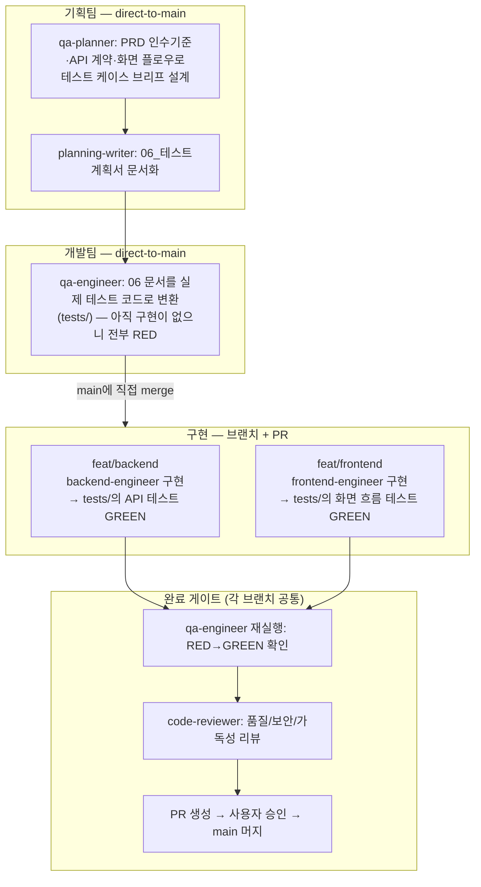

# Git 브랜치 전략 — 무엇을 direct-to-main으로, 무엇을 PR로

이 문서는 이 프로젝트에서 확립한 git 브랜치·머지 규칙을 정리한다. 절차만 담겨 있고 프로젝트 고유 데이터(폴더 이름 등)는 예시일 뿐이므로, 새 프로젝트에서도 그대로 재사용할 수 있다(포터블 — `docs/harness/reset-checklist.md` A그룹).

## 0. 대전제 — git 실행 권한은 메인 세션(사용자와 직접 대화하는 Claude)에만 있다

dev-team의 어떤 서브에이전트(backend-engineer/frontend-engineer/qa-engineer/dev-pl)도 git commit/push/PR/merge를 직접 실행하지 않는다. 이들의 Bash 접근은 로컬 실행·테스트용으로 한정된다. 브랜치 생성, 커밋, 푸시, PR 생성·머지는 전부 메인 세션이 사용자의 명시적 확인을 받은 뒤에만 수행한다.

## 1. 두 갈래 규칙 — "구현 코드"만 PR 게이트를 거친다

| 대상 | 머지 방식 | 이유 |
|---|---|---|
| 실제 구현 코드(예: `backend/`, `static/` — 프로젝트마다 TRD가 정한 실제 코드 폴더) | 브랜치 + PR + code-reviewer 리뷰 + 사용자 승인 | TDD 완료 게이트(qa-engineer 통과 + code-reviewer 리뷰)를 거친 하나의 완결된 작업 단위를 diff로 모아 검토하는 데 의미가 있다 |
| 그 외 전부 — 기획 문서(`docs/planning/**`), 디자인 산출물(`docs/design/**`), 하네스 정의(`.claude/agents/**`, `docs/harness/**`), 루트/팀별 `CLAUDE.md`, 테스트 스캐폴딩(`tests/`) | main에 직접 커밋·푸시(기존처럼 대화 중 사용자가 그때그때 확인) | 이미 대화창에서 사용자가 각 변경을 실시간으로 확인·승인하는 구조라, 별도 PR 리뷰 단계를 끼우면 같은 검토를 두 번 하는 것일 뿐 — 반복적인 소규모 수정의 흐름을 오히려 늦춘다 |

**판단 기준**: "이 변경이 TDD red→green 사이클을 거친 실제 애플리케이션 코드인가?"가 예/아니오를 가른다. 아니라면 direct-to-main이 맞다.

## 2. 브랜치는 폴더를 "잠그지" 않는다 — 분리는 두 가지 규율로 만든다

git 브랜치는 프로젝트 전체의 스냅샷이다. 특정 브랜치가 특정 폴더만 건드리게 되는 건 git이 강제해서가 아니라 아래 두 규율이 함께 작동하기 때문이다:

1. **작업 지시 범위**: 해당 브랜치에서 호출하는 에이전트(예: backend-engineer)의 지시 자체가 자기 폴더(`backend/`)만 다루도록 한정돼 있다 — 다른 폴더를 만질 이유 자체가 주어지지 않는다.
2. **커밋 시 파일 선별**: 메인 세션이 `git add {폴더}/...`처럼 그 브랜치에 속하는 파일만 골라 스테이징한다.

이 두 겹의 규율 때문에, 서로 다른 팀이 서로 다른 폴더를 병렬로 작업해도 실질적으로 충돌이 나지 않는다.

## 3. 병렬 구현 폴더가 겹치지 않으면 브랜치 충돌도 없다

이 프로젝트는 TRD가 확정한 파일 구조 자체가 팀별로 분리돼 있다(예: `backend/` ↔ `static/`, 서로 다른 팀이 서로 다른 폴더를 씀, 파일 하나도 안 겹침). 이 구조 덕분에 두 구현 브랜치를 어느 순서로 머지해도 충돌이 발생하지 않는다 — 각자 자기 폴더에 새 파일을 추가하는 것뿐이라 git이 "합치는" 작업이 기계적으로 끝난다.

새 프로젝트에서 이 이점을 그대로 누리려면, tech-architect가 파일 구조를 설계하는 단계에서부터 팀별 담당 폴더가 겹치지 않도록 미리 분리해두는 것이 중요하다(`.claude/agents/tech-architect.md` 판단 기준 참고).

## 4. TDD와 브랜치 분기 시점 — 공유 테스트 스캐폴딩을 먼저 main에 흡수한다

구현 코드 브랜치가 갈라지기 **전에** 테스트 스캐폴딩이 먼저 완성돼 있어야, 두 구현 브랜치 어느 쪽도 테스트 코드 자체를 건드릴 필요가 없어진다(테스트 파일까지 여러 브랜치가 손대기 시작하면 충돌 지점이 생긴다).

## 5. 완료 게이트 순서 요약

1. `feat/{team}` 브랜치에서 구현 완료
2. qa-engineer가 `tests/`를 재실행해 RED→GREEN 확인 (실패하면 구현으로 돌아감)
3. code-reviewer가 diff를 정적 리뷰
4. 메인 세션이 PR을 생성하고, 사용자에게 diff를 보여준 뒤 명시적 승인을 받는다
5. 승인 후에만 메인 세션이 머지를 실행한다 — 이 단계도 dev-team 에이전트가 아니라 메인 세션의 몫이다
