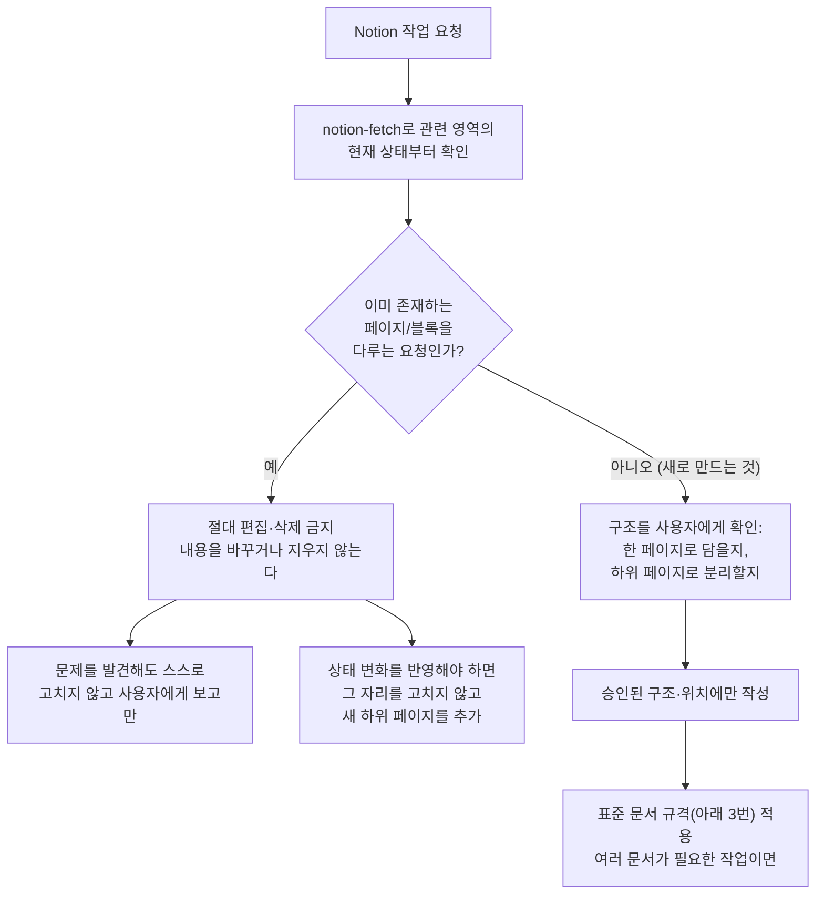
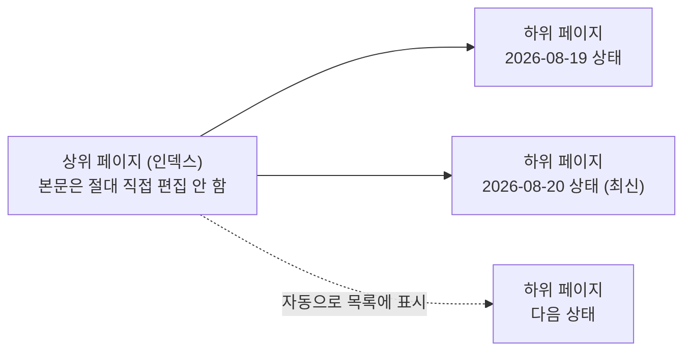
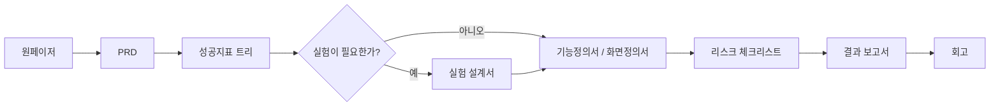

# Notion 작성/관리 워크플로우

## 배경

Notion은 완성된 보고서 산출물(Word/PPT/HTML로 별도 제작)을 두는 곳이 아니라, **프로젝트를 관리(계획·추적)하는 용도**로 쓴다. MCP로 연결해 작업할 때, 이미 존재하던 글이나 문서를 실수로 고치거나 지우면 안 된다. 이 문서는 그 원칙을 여러 프로젝트에서 재사용 가능한 절차로 정리한다(포터블 — `reset-checklist.md` A그룹).

## 절대 규칙 — 기존 콘텐츠는 절대 수정·삭제하지 않는다, 새 내용은 항상 추가만 한다

예외 없음. 이미 존재하는 페이지·블록(사용자가 직접 썼든, Claude가 예전에 만들었든 상관없이)은 **절대 편집·삭제하지 않는다.** 진행 상황이 바뀌어 "갱신"이 필요한 상황에서도 기존 내용을 고치는 게 아니라, 언제나 **새 페이지(또는 새 하위 페이지)를 추가**하는 방식으로 처리한다.

## 1. 작업 전 절차

1. **`notion-fetch`로 대상 영역의 현재 상태부터 확인한다** — 무엇이 이미 있는지 모른 채로 쓰기 시작하지 않는다.
2. **구조를 사용자에게 확인한다**: 이번 내용이 한 페이지에 다 담기면 되는지, 아니면 하위 페이지로 나눠야 하는지(예: 문서 종류가 여러 개거나 내용이 길 때) — 짐작해서 임의로 정하지 않는다.
3. **승인된 위치에만 작성한다.** 부모 페이지가 아직 정해지지 않았으면 작업을 시작하기 전에 반드시 먼저 물어본다 — 어울릴 것 같은 위치를 짐작해서 만들지 않는다(Figma 작업의 "새 파일 임의 생성 금지, 먼저 작업할 파일 링크부터 물어본다" 원칙과 같은 이유).

## 2. 진행 상황이 바뀌어 "갱신"이 필요한 경우 — 새 하위 페이지 추가로 처리한다

프로젝트 관리용 페이지(계획, 상태, 진행 로그 등)를 계속 최신으로 유지해야 하더라도, 그 페이지의 본문을 직접 고치지 않는다. 대신 그 페이지를 **인덱스 역할**로 두고, 상태가 바뀔 때마다 **새 하위 페이지**를 추가한다 — Notion의 하위 페이지 구조는 자식 페이지를 만들면 자동으로 상위 페이지에 나타나므로, 상위 페이지의 본문 블록을 수동으로 편집할 필요가 없다.

## 3. 표준 문서 규격 — 문서 종류와 순서

기획/제품 관리 성격의 작업을 Notion에 쌓아갈 때는, 특별히 다른 순서를 요구받지 않는 한 아래 순서를 기본값으로 따른다. 각 단계는 별도 페이지로 만든다(위 "하위 페이지로 분리" 원칙과 연결). 여기서 말하는 각 문서는 프로젝트를 관리하기 위한 작업 문서이지, Word/PPT/HTML로 별도 제작되는 완성 보고서를 대체하는 게 아니다.

- **원페이저**: 무엇을·왜 하는지 한 페이지로 요약.
- **PRD**: 요구사항을 구체화.
- **성공지표 트리**: 무엇으로 성공을 판단할지, 상위 지표부터 하위 지표까지 구조화.
- **실험 설계서**: A/B 테스트 등 실험이 필요한 경우에만 — 필요 없으면 건너뛴다.
- **기능정의서 / 화면정의서**: 실제로 무엇을 만들지 정의.
- **리스크 체크리스트**: 진행 전에 놓치기 쉬운 위험 요소 점검.
- **결과 보고서**: 실행 후 실제로 어떻게 됐는지 관리용으로 정리한 요약(완성 보고서 산출물과는 별개).
- **회고**: 다음에 반복하지 않을 교훈 정리.

이미 앞 단계 문서가 있는데 뒷 단계로 건너뛰라는 요청이 오면, 앞 단계가 실제로 존재하는지(로컬 `docs/planning/**` 등에 대응 문서가 있는지) 먼저 확인하고 없으면 사용자에게 알린다 — 있는데 형식만 Notion으로 옮기는 것뿐이면 그대로 옮긴다.

## 4. 새 프로젝트를 시작할 때 — 로컬 파일보다 Notion 확인이 먼저

새 프로젝트에서 기획/문서 작업을 시작하기 전에, 로컬 `docs/planning/**` 등을 먼저 채우기 시작하지 않고 **그 프로젝트에 이미 대응하는 Notion 페이지가 있는지부터 확인한다** — 사용자가 이미 Notion에서 관리를 시작해뒀는데 로컬에 새로 처음부터 만들면 두 곳이 어긋난 상태로 남는다. 있으면 그 내용을 출발점으로 삼고(위 "절대 편집 금지" 원칙에 따라 그 페이지 자체는 건드리지 않고 내용만 참고), 없으면 사용자에게 "Notion에 이 프로젝트용 관리 페이지를 새로 만들지" 물어본다.

## 5. 페이지를 시각적으로 잘 구성한다

새 페이지를 텍스트만 쭉 나열한 문서로 만들지 않는다 — 사용자 본인은 물론 다른 사람이 봐도 한눈에 구조가 들어오게, Notion이 기본 제공하는 서식 요소를 적극 활용한다.

- **아이콘**: 페이지 성격을 나타내는 이모지 아이콘을 페이지 제목에 붙인다 — 같은 인덱스 아래 하위 페이지가 여러 개 쌓일 때(위 2번) 아이콘만 보고도 종류를 구분할 수 있게 한다.
- **헤더·구분선**: 긴 내용을 헤더(H1/H2/H3)와 구분선(divider)으로 섹션을 나눈다 — 하나의 큰 문단 덩어리로 두지 않는다.
- **콜아웃 블록**: 결론·주의사항·핵심 요약처럼 먼저 눈에 띄어야 할 내용은 콜아웃 블록으로 강조한다.
- **토글 블록**: 세부 근거·부가 설명처럼 필요할 때만 펼쳐보면 되는 내용은 토글로 접어둬서 본문을 스캔하기 쉽게 유지한다.
- **표/데이터베이스**: 반복되는 항목(체크리스트, 지표, 비교표 등)은 일반 텍스트 나열 대신 표나 데이터베이스로 구조화한다(위 "3. 표준 문서 규격"의 리스크 체크리스트·성공지표 트리 등에 특히 해당).
- 이 기본값이 사용자가 이미 써온 페이지의 기존 형식과 안 맞으면, 형식 통일보다 "기존 문서와 안 어긋나는 것"을 우선한다(위 "절대 편집 금지" 원칙과 같은 이유 — 새로 만드는 페이지도 그 주변 페이지들과 스타일이 크게 튀지 않게 한다).

## 6. 완성된 보고서와의 관계

`docs/test-reports/`처럼 로컬에 쌓이는 완성 보고서(단위/통합 테스트 보고서 등), 그리고 그걸 Word/PPT/HTML 등으로 별도 제작하는 작업은 이 문서의 대상이 아니다 — 그건 "보고서 산출물" 관리 규칙(프로젝트별 `CLAUDE.md`에 명시)이고, 이 문서는 그것과 무관하게 "Notion을 프로젝트 관리 용도로 어떻게 쓸지"만 다룬다. 특정 프로젝트가 보고서를 Notion에도 링크/게시하기로 정했다면, 그건 이 문서의 규칙이 아니라 그 프로젝트 고유의 별도 관례다.
