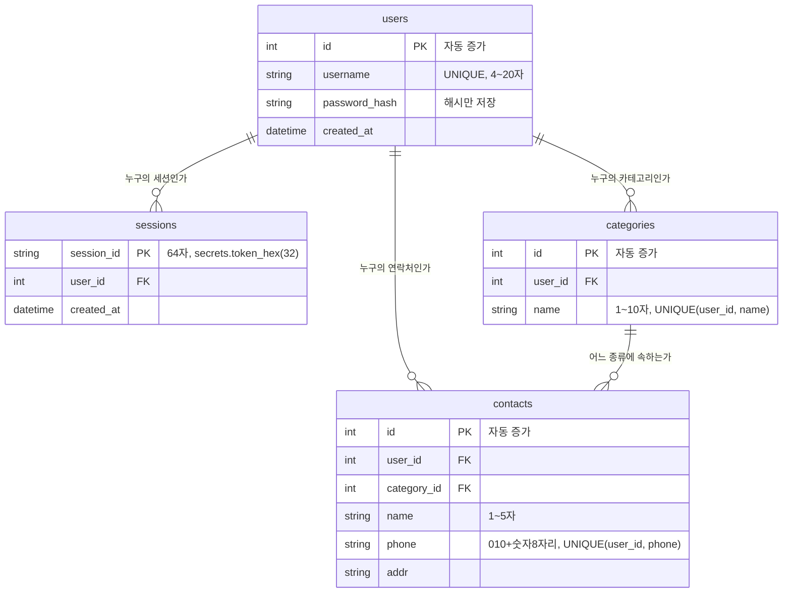
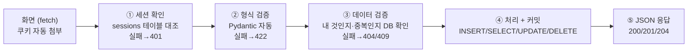
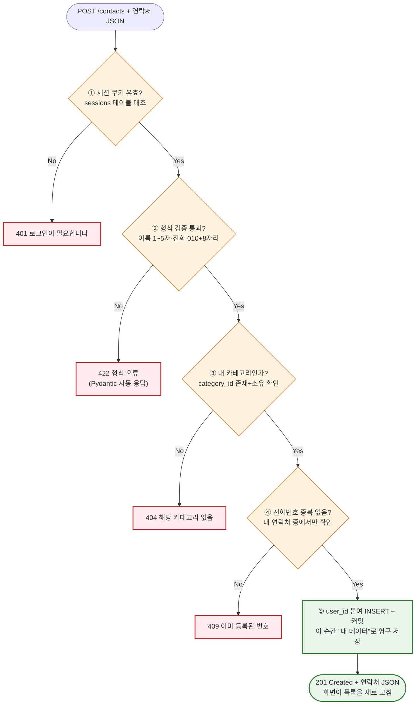

# 연락처 관리 웹 서비스 — 구현 요구사항 정의서 (2차 과제)

| 항목 | 내용 |
|---|---|
| 문서명 | 연락처 관리 웹 서비스(2차 과제) 구현 요구사항 정의서 |
| 문서 유형 | 구현 요구사항 (Implementation Requirements) |
| 과제 구분 | 2차 과제 — FastAPI + DB 연락처 프로그램 |
| 선행 과제 | 1차 과제 — 콘솔 연락처 관리 프로그램 |
| 버전 | v1.2 |
| 언어/환경 | Python 3.12+ / FastAPI 0.139.0 / SQLAlchemy 2.0.51 / PostgreSQL 16 (설치·충돌 검증 완료) |
| 상태 | 확정(Baseline) |

**이 문서의 역할(안내)** "프로그램이 무엇을, 어떤 규칙으로 처리해야 하는가"를 빠짐없이 적은 문서입니다. 코드를 짜기 전에 이 문서를 보면 "어떤 API가 있어야 하고, 어떤 입력을 받고, 어떤 경우에 어떤 오류 코드로 거부해야 하는지"를 알 수 있습니다. 개발의 설계도 역할을 합니다. 1차 과제의 구현요구사항 정의서와 같은 위치의 문서이며, 비교하며 읽으면 콘솔 → 웹 전환에서 무엇이 바뀌는지 정확히 보입니다.

**버전 관리 방침**: 이 문서(md)가 구현요구사항서의 정식 소스 오브 트루스입니다. 원본 PDF(v1.0)는 `docs/planning/old/01_연락처관리_웹서비스_구현요구사항_v1.0.pdf`로 이동 보존되어 있습니다(더 이상 갱신 안 함). 내용이 바뀔 때마다 PDF를 재변환하지 않고, 이 md 파일의 버전(v1.1, v1.2, ...)만 올려서 관리하고 참조합니다.

> **변경 이력**
> - **v1.2 (2026-07-14)**: 사용자 결정으로 "비밀번호 찾기" → "비밀번호 재설정" 명칭을 통일했습니다. §2 FR표 FR-14 기능명을 "비밀번호 찾기 (아이디 확인)" → "아이디 확인 (비밀번호 재설정 1단계)"로 정정(1단계는 아이디 존재 확인만 하므로 주-부 순서를 바로잡음), §3-5 절 제목 및 FR-14 소제목의 "비밀번호 찾기" 표기를 "비밀번호 재설정"으로 통일, §5-1 상태 코드 매트릭스 404 행 및 각주의 "비밀번호 찾기/재설정" 표기를 "비밀번호 재설정"으로 정리, §10 요구사항 추적표 UC-09 셀을 "비밀번호 재설정"으로 통일했습니다. API 경로(`POST /auth/find-password` 등) 문자열 자체는 코드 식별자라 변경하지 않았습니다. §3-5 "배경" 문단의 화면정의서 버전 인용도 v1.5로 동기화했습니다. 근거: `docs/planning/service-concept.md` §3-3. 과거 v1.1 로그는 그대로 둡니다.
> - **v1.1 (2026-07-14)**: PDF(v1.0) → md 최초 전환. 사용자 승인 하에 진행된 정합화 라운드로서, `docs/planning/tech-architecture.md` §4(tech-architect 브리프 — FR-14/FR-15 API 계약 확정)를 그대로 반영했습니다: ① §2 FR표에 FR-14(`POST /auth/find-password`)·FR-15(`PATCH /auth/password`) 행 추가 + 공통 규칙 불릿에 두 API를 비로그인 접근 허용 목록으로 추가, ② §3에 "3-5. 비밀번호 찾기(FR-14~FR-15)" 절 신설(요청/응답, 처리 순서, DB 영향, 세션 전체 무효화 결정 근거 포함), ③ §5-1 상태 코드 매트릭스 404 행에 비밀번호 찾기/재설정 케이스 추가, ④ §10 요구사항 추적표에 FR-14~15 행 추가. 기존 FR-01~13 행과 문구는 변경하지 않았습니다(surgical). §1-1/§8/§9의 다이어그램 이미지는 md 전환 과정에서 원본 내용 그대로 Mermaid(ER 다이어그램·flowchart)로 재작성했습니다.
> - **v1.0 (원본 PDF)**: 최초 확정본. 상세 변경 이력 없음(PDF 원본).

---

## 1. 데이터 모델 (테이블 4개)

1차 과제는 딕셔너리 1개가 전부였지만, 2차 과제는 역할별로 나뉜 테이블 4개를 사용합니다. "왜 4개나 필요한가?"부터 이해하고 시작합시다.

| 테이블 | 담는 것 | 1차 과제에서의 대응물 | 왜 필요한가 |
|---|---|---|---|
| `users` | 로그인하는 사용자 계정 | (없음 — 신규) | 여러 명이 쓰려면 "누구"를 저장해야 함 |
| `sessions` | 현재 로그인 상태 | (없음 — 신규) | "지금 로그인 중인 사람" 명단(장부) |
| `categories` | 연락처 종류 (가족/친구/기타 + 사용자 추가분) | 코드에 고정된 3개 문자열 | 사용자가 직접 추가/수정/삭제하려면 데이터로 관리해야 함 |
| `contacts` | 연락처 본체 | 딕셔너리의 회원 1명 | 1차 과제의 핵심 데이터 그대로 |

### 1-1. 데이터 모델 관계도 (아키텍처)



> **다이어그램 변환 안내(v1.1)**: 원본(v1.0)은 이 절을 이미지로 제공했습니다. md 전환 과정에서 Mermaid erDiagram으로 재작성했으며, 원본 이미지의 내용만 그대로 옮겼습니다.

**읽는 법(초보자용)**: 화살표는 전부 외래키(FK)이고, "이 행의 주인/소속이 누구인가"를 가리킵니다. 예를 들어 `contacts`의 어떤 행에 `user_id = 1, category_id = 2`가 적혀 있다면 — "users 테이블 1번 사용자(happyday)의 연락처이고, categories 테이블 2번(친구)에 속한다"는 뜻입니다. 엑셀로 비유하면 시트 4장이 있고, 각 시트의 행이 다른 시트의 행 번호를 적어 두는 것입니다.

### 1-2. 테이블별 상세 정의

**users — 사용자(로그인 계정)**

| 열 | 타입(개념) | 제약 | 설명 |
|---|---|---|---|
| id | 정수 (자동 증가) | PK | 사용자 고유 번호 |
| username | 문자열 4~20자 | UNIQUE, NOT NULL | 로그인 아이디 (영문 소문자·숫자만) |
| password_hash | 문자열 | NOT NULL | Argon2 해시 결과만 저장 (원문 저장 절대 금지) |
| created_at | 일시 | 기본값 = 현재 시각 | 가입 시각 |

**sessions — 로그인 장부**

| 열 | 타입(개념) | 제약 | 설명 |
|---|---|---|---|
| session_id | 문자열 64자 | PK | `secrets.token_hex(32)`로 발급하는 무작위 번호 |
| user_id | 정수 | FK → users.id, NOT NULL | 이 세션의 주인 |
| created_at | 일시 | 기본값 = 현재 시각 | 로그인 시각 |

**categories — 연락처 종류**

| 열 | 타입(개념) | 제약 | 설명 |
|---|---|---|---|
| id | 정수 (자동 증가) | PK | 카테고리 번호 |
| user_id | 정수 | FK → users.id, NOT NULL | 소유 사용자 (카테고리도 사용자별로 따로) |
| name | 문자열 1~10자 | NOT NULL | 카테고리 이름 |
| (테이블 제약) | | UNIQUE(user_id, name) | 같은 사용자 안에서 이름 중복 금지 |

**contacts — 연락처 본체**

| 열 | 타입(개념) | 제약 | 설명 |
|---|---|---|---|
| id | 정수 (자동 증가) | PK | 연락처 고유 번호 |
| user_id | 정수 | FK → users.id, NOT NULL | 이 연락처의 주인 |
| category_id | 정수 | FK → categories.id, NOT NULL | 소속 카테고리 |
| name | 문자열 1~5자 | NOT NULL | 이름 (1차 과제와 동일 규칙) |
| phone | 문자열 11자 | NOT NULL | 전화번호 (010 + 숫자 8자리) |
| addr | 문자열 | 빈 값 허용 | 주소 (1차 과제와 동일하게 검증 없음) |
| (테이블 제약) | | UNIQUE(user_id, phone) | 같은 사용자 안에서 전화번호 중복 금지 |

### 1-3. 설계 결정과 그 근거 (중요 — 반드시 읽기)

**① 식별자는 전화번호가 아니라 id(자동 증가 번호)다.**

1차 과제 문서는 "전화번호를 식별자로 권장"했습니다. 2차 과제에서는 id를 기본키로 확정합니다. 이유는 두 가지입니다.

- 전화번호는 바뀌는 값입니다. 2차 과제에는 수정 기능이 있어서 전화번호 자체를 고칠 수 있습니다. 기본키가 바뀌면 그 값을 참조하는 모든 곳이 함께 흔들립니다. 기본키는 "한 번 정해지면 절대 안 바뀌는 값"이어야 합니다.
- 실무 표준입니다. 실무 테이블 대부분이 "의미 없는 자동 증가 번호"를 기본키로 씁니다(대리키, surrogate key). 의미 있는 값(전화번호, 주민번호 등)은 언젠가 바뀌거나 정책이 바뀌기 때문입니다.

전화번호의 "중복 방지" 역할은 사라지지 않습니다 — 기본키 대신 UNIQUE 제약으로 유지합니다.

**② UNIQUE가 전화번호 단독이 아니라 (user_id, phone) 쌍인 이유**

사용자 A와 사용자 B가 같은 사람(같은 번호)을 각자 자기 연락처로 저장할 수 있어야 합니다. 전화번호를 테이블 전체에서 UNIQUE로 걸면 "B는 A가 이미 저장한 번호를 저장할 수 없는" 이상한 서비스가 됩니다. "내 연락처 안에서만 중복 금지"가 올바른 규칙이고, 그것이 복합 UNIQUE (user_id, phone)입니다.

**③ 회원가입 시 기본 카테고리 3개 자동 생성**

가입이 성공하면 그 사용자의 카테고리로 가족/친구/기타 3개를 자동으로 만들어 줍니다. 1차 과제와 같은 출발선에서 시작하고, 빈 카테고리 목록 때문에 연락처를 하나도 추가하지 못하는 상황을 막기 위함입니다.

**④ 동명이인 문제는 구조적으로 해소된다**

1차 과제의 대표 이슈였던 동명이인(윤아 2명) 처리는 2차 과제에서 자연스럽게 풀립니다. 모든 연락처가 고유한 id를 가지므로, 화면 목록에서 클릭한 행의 id로 수정/삭제 대상을 지정하면 됩니다. 1차의 "번호를 입력하세요" 단계가 "목록에서 클릭"으로 바뀌는 것입니다. 이름 검색 기능(`GET /contacts?name=윤아`)은 그대로 제공합니다.

---

## 2. 기능 요구사항 목록 (FR)

| ID | 그룹 | 기능 | API | 필수 여부 |
|---|---|---|---|---|
| FR-01 | 인증 | 회원가입 | `POST /auth/signup` | 필수 |
| FR-02 | 인증 | 로그인 (세션 발급) | `POST /auth/login` | 필수 |
| FR-03 | 인증 | 로그아웃 (세션 삭제) | `POST /auth/logout` | 필수 |
| FR-04 | 인증 | 내 정보 확인 | `GET /auth/me` | 필수 |
| FR-05 | 연락처 | 연락처 추가 | `POST /contacts` | 필수 |
| FR-06 | 연락처 | 연락처 목록 조회 + 이름 검색 | `GET /contacts` | 필수 |
| FR-07 | 연락처 | 연락처 수정 (부분 수정) | `PATCH /contacts/{id}` | 필수 |
| FR-08 | 연락처 | 연락처 삭제 | `DELETE /contacts/{id}` | 필수 |
| FR-09 | 카테고리 | 카테고리 목록 조회 | `GET /categories` | 필수 |
| FR-10 | 카테고리 | 카테고리 추가 | `POST /categories` | 필수 |
| FR-11 | 카테고리 | 카테고리 이름 수정 | `PATCH /categories/{id}` | 필수 |
| FR-12 | 카테고리 | 카테고리 삭제 | `DELETE /categories/{id}` | 필수 |
| FR-13 | 화면 | 웹 화면 제공 (로그인/관리) | `GET /` | 필수 |
| FR-14 | 인증 | 아이디 확인 (비밀번호 재설정 1단계) | `POST /auth/find-password` | 필수 |
| FR-15 | 인증 | 비밀번호 재설정 | `PATCH /auth/password` | 필수 |

> **FR-14/FR-15 신설(v1.1)**: PRD v1.1의 PR-13(비밀번호 재설정)·UC-09·AC-18에 대응하는 API 계약입니다. 근거: `docs/planning/tech-architecture.md` §4. "API 1개당 FR 1개" 관례(본 절 상단 규칙)를 그대로 따라 1단계(아이디 확인)와 2단계(비밀번호 변경)를 FR-14/FR-15로 분리했습니다.

**1차 과제와의 대응**: 1차의 메뉴 1~4(추가/목록/수정/삭제)가 FR-05~08로, 메뉴 5(종료 시 저장)는 사라졌습니다(DB가 요청마다 즉시 저장하므로 저장 메뉴가 필요 없음). 대신 인증 4개(FR-01~04)와 카테고리 4개(FR-09~12)가 새로 생겼습니다 — 카테고리 4개는 연락처 CRUD와 완전히 같은 패턴의 반복이라 새로 배울 것이 거의 없습니다.

**공통 규칙 (모든 FR에 적용)**

- FR-05 ~ FR-12는 로그인 필수입니다. 유효한 세션 쿠키가 없으면 무조건 401 응답. (FR-13 화면과 FR-01/02, 그리고 FR-14/15는 로그인 전에도 접근 가능)
- 모든 조회/수정/삭제는 "내 것"만 대상입니다. 다른 사용자의 데이터는 id를 알아도 없는 것처럼(404) 응답합니다.
- 어떤 잘못된 입력에도 서버가 500(서버 내부 오류)을 내면 안 됩니다. (1차 과제의 "프로그램이 죽지 않을 것"에 해당)

---

## 3. 기능별 상세 명세

### 3-1. 인증 (FR-01 ~ FR-04)

**FR-01 · 회원가입 — `POST /auth/signup`**

| 항목 | 내용 |
|---|---|
| 요청 본문 | `{"username": "happyday", "password": "pass1234"}` |
| 처리 | ① 형식 검증(§4) ② 아이디 중복 확인 ③ 비밀번호를 Argon2로 해시 ④ users에 저장 ⑤ 기본 카테고리 3개(가족/친구/기타) 자동 생성 |
| 성공 | 201 — `{"id": 1, "username": "happyday"}` |
| 실패 | 409 아이디 중복 / 422 형식 위반(4자 미만, 대문자 등) |

**FR-02 · 로그인 — `POST /auth/login`**

| 항목 | 내용 |
|---|---|
| 요청 본문 | `{"username": "happyday", "password": "pass1234"}` |
| 처리 | ① 아이디로 사용자 조회 ② 비밀번호를 해시와 대조(verify) ③ 성공 시 `secrets.token_hex(32)`로 세션 번호 발급 ④ sessions에 기록 ⑤ 응답에 `Set-Cookie: session_id=...` 포함 |
| 성공 | 200 — `{"message": "로그인 성공"}` + 세션 쿠키 |
| 실패 | 401 — `{"detail": "아이디 또는 비밀번호가 올바르지 않습니다"}` |

> ⚠️ **실무 보안 규칙**: 로그인 실패 시 "아이디가 없습니다"와 "비밀번호가 틀렸습니다"를 구분해서 알려주지 않습니다. 구분해 주면 공격자가 "이 아이디는 존재하는구나"를 알아낼 수 있기 때문입니다. 항상 같은 문구 하나로 응답합니다.

**FR-03 · 로그아웃 — `POST /auth/logout`**

| 항목 | 내용 |
|---|---|
| 처리 | sessions에서 해당 세션 행 삭제 + 쿠키 삭제 지시 |
| 성공 | 200 — `{"message": "로그아웃 되었습니다"}` (이미 로그아웃 상태여도 200 — 결과가 같으므로) |

**FR-04 · 내 정보 확인 — `GET /auth/me`**

| 항목 | 내용 |
|---|---|
| 용도 | 화면이 "지금 로그인되어 있나? 누구로?"를 확인할 때 사용 |
| 성공 | 200 — `{"id": 1, "username": "happyday"}` |
| 실패 | 401 — 세션 없음/무효 |

### 3-2. 연락처 (FR-05 ~ FR-08) — 모두 로그인 필수

**FR-05 · 연락처 추가 — `POST /contacts`**

| 항목 | 내용 |
|---|---|
| 요청 본문 | `{"name": "윤아", "phone": "01012345678", "addr": "서울시", "category_id": 2}` |
| 처리 | ① 세션 확인 ② 형식 검증(§4) ③ category_id가 내 카테고리인지 확인 ④ 내 연락처 중 전화번호 중복 확인 ⑤ user_id를 붙여 INSERT + 커밋 |
| 성공 | 201 — `{"id": 1, "name": "윤아", "phone": "01012345678", "addr": "서울시", "category_id": 2, "category_name": "친구"}` |
| 실패 | 401 미로그인 / 404 내 카테고리 아님·없음 / 409 전화번호 중복 / 422 형식 위반 |

**FR-06 · 연락처 목록 조회 + 이름 검색 — `GET /contacts`**

| 항목 | 내용 |
|---|---|
| 요청 | `GET /contacts`(전체) 또는 `GET /contacts?name=윤아`(이름 검색) 또는 `GET /contacts?category_id=2`(종류 필터) |
| 처리 | 내(user_id) 연락처만 조회. 검색어가 있으면 이름 일치 필터 추가 |
| 성공 | 200 — `{"total": 3, "items": [ {...}, {...}, {...} ]}` |

응답 예시 (1차 과제의 "총 3 명..." 출력이 JSON의 total 필드로 바뀐 것입니다):

```json
{
  "total": 3,
  "items": [
    {"id": 1, "name": "윤아", "phone": "01012345678", "addr": "서울시", "category_id": 2, "category_name": "친구"},
    {"id": 2, "name": "은혁", "phone": "01011112222", "addr": "수원시", "category_id": 3, "category_name": "기타"},
    {"id": 3, "name": "윤아", "phone": "01023456789", "addr": "부산광역시", "category_id": 1, "category_name": "가족"}
  ]
}
```

> 동명이인 "윤아" 2명이 각자 다른 id(1번, 3번)를 갖고 나란히 조회됩니다. 화면은 이 목록을 그대로 표로 그리고, 수정/삭제 버튼에 각 행의 id를 연결하면 됩니다 — 1차 과제의 "번호를 입력하세요"가 필요 없어진 이유입니다.

**FR-07 · 연락처 수정 — `PATCH /contacts/{id}` (부분 수정)**

| 항목 | 내용 |
|---|---|
| 요청 본문 | 바꿀 항목만 보냄. 예: 주소만 수정 → `{"addr": "제주시"}` |
| 처리 | ① 세션 확인 ② `{id}`가 내 연락처인지 확인 ③ 보낸 항목만 형식 검증 후 갱신 ④ (phone 변경 시) 중복 확인 ⑤ (category_id 변경 시) 내 카테고리인지 확인 ⑥ 커밋 |
| 성공 | 200 — 수정 완료된 연락처 전체 JSON |
| 실패 | 401 / 404 없는 id·남의 연락처 / 409 전화번호 중복 / 422 형식 위반 |

**FR-08 · 연락처 삭제 — `DELETE /contacts/{id}`**

| 항목 | 내용 |
|---|---|
| 처리 | ① 세션 확인 ② 내 연락처인지 확인 ③ 삭제 + 커밋 |
| 성공 | 204 — 본문 없음 (삭제 성공의 표준 응답) |
| 실패 | 401 / 404 없는 id·남의 연락처 (1차 과제의 "해당하는 회원 정보가 없습니다."에 해당) |

### 3-3. 카테고리 (FR-09 ~ FR-12) — 모두 로그인 필수

연락처와 완전히 같은 CRUD 패턴입니다. 다른 점은 단 하나 — 삭제 시 "사용 중" 확인입니다.

| FR | API | 요청 예 | 성공 | 실패 |
|---|---|---|---|---|
| FR-09 목록 | `GET /categories` | - | 200 `[{"id":1,"name":"가족"}, {"id":2,"name":"친구"}, {"id":3,"name":"기타"}]` | 401 |
| FR-10 추가 | `POST /categories` | `{"name": "동호회"}` | 201 `{"id":4,"name":"동호회"}` | 401 / 409 이름 중복 / 422 |
| FR-11 수정 | `PATCH /categories/{id}` | `{"name": "베프"}` | 200 수정된 카테고리 | 401 / 404 / 409 이름 중복 / 422 |
| FR-12 삭제 | `DELETE /categories/{id}` | - | 204 | 401 / 404 / 409 사용 중 |

**FR-12의 핵심 규칙 — 사용 중인 카테고리는 삭제 거부**

그 카테고리에 속한 연락처가 1건이라도 있으면 삭제를 거부하고 이유를 알려줍니다.

```json
// DELETE /categories/2 (친구 카테고리에 연락처 2건이 소속된 상태)
// → 409
{"detail": "이 카테고리를 사용하는 연락처가 2건 있어 삭제할 수 없습니다. 연락처의 종류를 먼저 변경하세요."}
```

> 왜 이렇게 하나요? 카테고리를 그냥 지우면 소속 연락처들의 category_id가 없는 번호를 가리키게 됩니다(고아 데이터). DB의 FK 제약이 이를 원천 차단하는데, 그 차단을 오류(500)로 노출하지 않고 친절한 409 안내로 바꿔 주는 것이 이 요구사항입니다. 1차 과제의 동명이인 처리처럼, 2차 과제의 대표 엣지 케이스입니다.

### 3-4. 화면 (FR-13) — `GET /`

| 항목 | 내용 |
|---|---|
| 처리 | HTML 화면 1장 제공. 로그인 전: 로그인/회원가입 폼, 로그인 후: 연락처·카테고리 관리 화면 |
| 상세 | 화면 구성·전이는 02. 화면 정의서에서 정의 |

### 3-5. 비밀번호 재설정(FR-14~FR-15) — 모두 로그인 불필요 (신규, v1.1)

**배경**: 화면정의서 v1.3(현재 v1.5) SCR-004가 이미 정의한 2단계 UI 흐름(1단계 아이디 확인 → 2단계 비밀번호 재설정)에 대응하는 API 계약입니다. 본인 확인 방식은 `docs/planning/service-concept.md` §3에서 "아이디만 확인 후 즉시 재설정"으로 이미 채택 완료된 상태이며, 이 절은 그 결정을 API/DB 계약 수준으로 구체화한 것입니다. 근거: `docs/planning/tech-architecture.md` §4.

**FR-14 · 아이디 확인 (비밀번호 재설정 1단계) — `POST /auth/find-password`**

| 항목 | 내용 |
|---|---|
| 로그인 필요 | 불필요 |
| 요청 본문 | `{"username": "happyday"}` |
| 처리 | ① username 형식 검증(§4-1, `SignupIn.username`과 동일한 규칙: 4~20자, `^[a-z0-9]+$`) ② users에서 아이디 존재 확인 |
| 성공 | 200 — `{"username": "happyday"}` |
| 실패 | 404 존재하지 않는 아이디 / 422 형식 위반 |

**FR-15 · 비밀번호 재설정 — `PATCH /auth/password`**

| 항목 | 내용 |
|---|---|
| 로그인 필요 | 불필요 |
| 요청 본문 | `{"username": "happyday", "new_password": "newpass1234"}` |
| 처리 | ① username으로 사용자 조회(없으면 404) ② new_password 형식 검증(§4-1, `SignupIn.password`와 동일한 규칙: 4~20자) ③ new_password를 Argon2로 해시 ④ users.password_hash UPDATE ⑤ 같은 트랜잭션에서 해당 user_id의 sessions 전체 행 DELETE ⑥ commit |
| 성공 | 200 — `{"message": "비밀번호가 변경되었습니다"}` |
| 실패 | 404 존재하지 않는 아이디 / 422 형식 위반 |

**설계 판단과 근거 (`docs/planning/tech-architecture.md` §4 그대로 인용)**

1. **FR 분리(FR-14/FR-15로 별도 배정)**: "API 1개당 FR 1개" 관례(§2 공통 규칙)를 그대로 따른 것. 하나로 합치면 "1단계는 조회, 2단계는 쓰기"라는 서로 다른 성격의 작업이 한 FR에 섞여 추적표(§10)의 의미가 흐려진다.
2. **`find-password` 응답에 `id`를 넣지 않음**: `GET /auth/me`(FR-04)는 이미 로그인된 사용자에게 자기 `id`를 알려주지만, `find-password`는 아직 인증되지 않은 상태에서 호출되므로 최소 정보 노출 원칙에 따라 입력받은 `username`을 그대로 echo하는 데 그친다. 클라이언트는 이미 입력값을 갖고 있으므로 `id`가 실질적으로 필요하지도 않다.
3. **`new_password` 확인란(비밀번호 재입력)은 서버로 보내지 않음**: 화면정의서 SCR-004가 "클라이언트가 사전에 두 값 일치를 검증하고, 불일치 시 API 호출 자체를 하지 않는다"고 규정했으므로, 서버 계약은 `new_password` 단일 필드만 받는다.
4. **비밀번호 재설정 시 기존 세션 전체 무효화**: `PATCH /auth/password` 처리 시 `users.password_hash`를 갱신하는 것과 같은 트랜잭션에서 해당 `user_id`의 `sessions` 행을 전부 삭제한다. 근거 — 비밀번호가 바뀌었다면 그 이전에 발급된 세션은 더 이상 "본인이 확인한 자격"을 대변하지 않으므로, 실무 보안 모범 사례상 강제 재로그인을 요구하는 것이 맞다. 이 결정은 `docs/planning/service-concept.md` §3이 명시한 트레이드오프("아이디만 알면 누구나 비밀번호를 바꿀 수 있다")를 뒤집지는 않지만, 그 트레이드오프의 피해 범위를 줄이는 보완책이다 — 공격자가 비밀번호를 바꿔도 원래 사용자의 기존 세션이 자동으로 함께 끊긴다.
5. **DB 영향 범위**: 스키마 변경 없음(테이블/컬럼 추가 없음). FR-14는 `users.id`, `users.username` 조회(읽기 전용). FR-15는 `users.password_hash` UPDATE + `sessions` 테이블에서 해당 `user_id`의 전체 행 DELETE.
6. **형식 검증 재사용**: `username`은 `SignupIn.username`과 동일한 규칙, `new_password`는 `SignupIn.password`와 동일한 규칙을 그대로 재사용한다 — 새 정규식을 만들지 않는다.

---

## 4. 유효성 검사 규칙 (Validation Rules)

### 4-1. 규칙표 — 실제 실행으로 검증됨

아래 규칙 전체를 FastAPI + Pydantic으로 실제 구현해 16개 케이스를 실행, 전부 기대한 결과(200/422)가 나옴을 확인했습니다.

| 대상 | 규칙 | 통과 예 | 실패 예 (→ 422) |
|---|---|---|---|
| 아이디 (username) | 4~20자, 영문 소문자·숫자만 (`^[a-z0-9]+$`) | happyday | abc(3자), HappyDay1(대문자) |
| 비밀번호 (password) | 4~20자 | pass1234 | abc(3자) |
| 이름 (name) | 1~5자 | 윤아, 가나다라마 | (빈 값), 가나다라마바(6자) |
| 전화번호 (phone) | `^010\d{8}$` — 010 + 숫자 8자리 | 01012345678 | 123, 010-1234-5678, 010abcdefgh, 01112345678 |
| 주소 (addr) | 검증 없음 (빈 값 허용) | 서울시, (빈 값) | - |
| 카테고리명 (name) | 1~10자 | 동호회 | (빈 값), 11자 이상 |

> **전화번호 형식 확정 선언**: 1차 과제 문서의 미해결 이슈였던 "하이픈 포함(000-0000-0000) vs 11자리 숫자"는, 2차 과제에서 하이픈 없는 11자리(`^010\d{8}$`)로 확정합니다. 1차 과제의 실제 입출력 화면 예시(01012345678)와 일치하는 형식이기 때문입니다. 하이픈 포함 입력(010-1234-5678)은 실행 검증 결과 정확히 422로 거부됩니다.

### 4-2. 검증의 2계층 구조 (초보자 핵심 개념)

1차 과제에서는 모든 검사를 if 문으로 직접 짰지만, 2차 과제의 검증은 성격이 다른 2계층으로 나뉩니다. 이 구분을 이해하는 것이 이번 과제 유효성 파트의 핵심입니다.

| 계층 | 무엇을 검사하나 | 누가 하나 | 실패 시 | 예 |
|---|---|---|---|---|
| ① 형식 검증 | 입력 그 자체만 보고 판단 가능한 규칙 | Pydantic이 자동 | 422(자동 응답) | 이름 6자, 전화번호 형식, 빈 값 |
| ② 데이터 검증 | DB를 조회해야 판단 가능한 규칙 | 우리가 직접 코드 작성 | 404 / 409 | 전화번호 중복, 없는 카테고리, 사용 중 카테고리 |

> **비유로 이해하기 — "입구 검표와 좌석 확인"** 공연장 입구에서 표의 모양·날짜가 맞는지는 표만 보면 압니다(형식 검증 = Pydantic 자동). 하지만 "그 좌석에 이미 다른 사람이 앉아 있는지"는 객석을 봐야 압니다(데이터 검증 = DB 조회 후 우리가 판단). 1차 과제의 `validate_phone` 같은 형식 검사는 전부 ①로 넘어가 코드가 사라지고, 우리가 짤 것은 ②만 남습니다.

---

## 5. 예외 처리 요구사항 (Exception Handling)

1차 과제의 원칙 "어떤 입력에도 프로그램이 죽지 않는다"는 2차 과제에서 "어떤 요청에도 500이 나지 않고, 의미에 맞는 상태 코드로 응답한다"로 바뀝니다.

### 5-1. 상태 코드 매트릭스

| 코드 | 의미 | 발생 상황 (본 과제) | 1차 과제에서의 대응물 |
|---|---|---|---|
| 401 | 로그인 필요 / 인증 실패 | 세션 쿠키 없음·무효, 로그인 시 아이디/비밀번호 불일치 | (없음 — 신규) |
| 404 | 대상 없음 | 없는 id 접근, 남의 데이터 id 접근, 없는 카테고리 지정, 존재하지 않는 아이디로 비밀번호 재설정 시도(FR-14/15) | "해당하는 회원 정보가 없습니다." |
| 409 | 규칙 충돌 | 아이디 중복, (내 연락처 중) 전화번호 중복, (내 카테고리 중) 이름 중복, 사용 중 카테고리 삭제 | 동명이인·중복 관련 안내 |
| 422 | 형식 위반 | §4-1 규칙 위반 (Pydantic 자동) | 유효성 검사 실패 → 재입력 |
| 500 | 서버 내부 오류 | 발생하면 안 됨 (발생 = 예외 처리 누락) | 프로그램 강제 종료 (= 하면 안 되는 것) |

> **404 행 갱신(v1.1)**: "존재하지 않는 아이디로 비밀번호 재설정 시도(FR-14/15)"를 추가했습니다. 근거: `docs/planning/tech-architecture.md` §4.

### 5-2. 반드시 지킬 두 가지 원칙

**① 남의 데이터는 403(권한 없음)이 아니라 404(없음)로 응답한다.**

사용자 B가 사용자 A의 연락처 id로 `DELETE /contacts/1`을 호출하면 404를 반환합니다. 403을 쓰면 "그 id의 데이터가 존재한다"는 사실 자체를 알려주는 셈이 되기 때문입니다. 실무에서는 존재 여부조차 숨기는 것이 표준입니다. (구현도 간단합니다 — 조회 조건에 user_id를 항상 포함하면, 남의 데이터는 조회 자체가 안 되어 자연스럽게 404가 됩니다.)

**② 모든 오류 응답은 `{"detail": "사람이 읽을 수 있는 한국어 안내"}` 형태로 통일한다.**

FastAPI의 `HTTPException(status_code=..., detail=...)`이 만드는 표준 형태입니다. 화면(JavaScript)은 어떤 오류든 `detail`만 꺼내서 사용자에게 보여주면 되므로, 오류 표시 코드가 한 벌로 끝납니다.

### 5-3. 놓치기 쉬운 비정상 상황 목록 (1차 과제 §5 대응)

| 구분 | 상황 | 요구 동작 |
|---|---|---|
| 인증 | 로그인 없이 데이터 API 호출 | 401 + 안내, 화면은 로그인 폼 표시 |
| 인증 | 서버 재시작 후 이전 쿠키로 접근 | sessions 테이블에 있으므로 정상 동작 (세션을 DB에 두는 이유) |
| 인증 | 존재하지 않는 세션 번호를 쿠키로 보냄 | 401 (장부에 없는 출입증) |
| 검색 | 검색 결과 0건 | 200 + `{"total": 0, "items": []}` — 오류가 아님 (1차의 "총 0명" 안내에 해당) |
| 선택 | 없는 id / 남의 id로 수정·삭제 | 404 |
| 입력 | 숫자가 와야 할 자리에 문자 (`/contacts/abc`) | FastAPI 타입 힌트가 자동으로 422 처리 |
| 입력 | JSON이 아예 깨진 요청 | FastAPI가 자동으로 422 처리 |
| DB | DB 컨테이너(pg-lab)가 꺼져 있음 | 서버 시작/요청 시 연결 오류 — 실행 전 Docker 확인 절차를 README에 명시 |

---

## 6. 저장(영속화) 요구사항

| 항목 | 요구사항 |
|---|---|
| 저장소 | PostgreSQL 16 (Docker 컨테이너 pg-lab) |
| 저장 시점 | 각 요청 처리 성공 시 즉시 커밋 (1차의 "종료 시 1회 저장"과 가장 크게 다른 점) |
| 실패 시 | 처리 도중 오류가 나면 롤백 — 반쪽짜리 데이터가 남지 않음 |
| 로그인 상태 | sessions도 테이블이므로 서버를 재시작해도 로그인이 유지됨 |
| 확인 방법 | 서버 재시작 후 재접속 → 데이터·로그인 유지 확인 / psql로 SELECT 직접 확인 |

> **1차 과제와의 비교**: 1차에서는 저장(`pickle.dump`)을 우리가 직접, 종료 시점에 호출했습니다. 2차에서는 "커밋"이 곧 저장이며 요청마다 일어납니다. 그래서 "저장" 메뉴 자체가 사라졌고, 강제 종료로 데이터가 날아가는 1차의 약점도 사라집니다.

---

## 7. 비기능 요구사항 (NFR)

| ID | 요구사항 |
|---|---|
| NFR-01 | 어떤 요청에도 서버가 500을 응답하지 않을 것 (모든 예외를 의미 있는 상태 코드로 변환) |
| NFR-02 | 계층별 파일 분리: 라우터 / CRUD / 모델 / 스키마 (한 파일 덩어리 금지) |
| NFR-03 | 비밀번호는 Argon2 해시로만 저장 (원문·복호화 가능 형태 저장 금지) |
| NFR-04 | 데이터 API(FR-05~12) 전부 로그인 필수 + user_id 격리 (예외 없음) |
| NFR-05 | 한글 입출력이 깨지지 않을 것 (UTF-8) |
| NFR-06 | 자동 API 문서(/docs)가 항상 열리고, 문서만 보고 API를 테스트할 수 있을 것 |

---

## 8. 전체 워크플로우 — 모든 요청의 공통 처리 파이프라인

FR-05~12의 모든 요청은 아래 동일한 5단계 파이프라인을 지납니다. 이 그림 하나를 이해하면 12개 기능 전부의 골격을 이해한 것입니다.



> ① 은 로그인 필수 API(FR-05~12)에만 적용 · ② 는 본문이 있는 요청(POST/PATCH)에만 적용. 어느 단계에서 실패하든 이후 단계는 실행되지 않고 즉시 오류 응답(그래서 500이 나지 않음).
>
> **다이어그램 변환 안내(v1.1)**: 원본(v1.0)은 이 절을 이미지로 제공했습니다. md 전환 과정에서 Mermaid flowchart로 재작성했으며, 원본 이미지의 내용만 그대로 옮겼습니다.

---

## 9. 단계별 워크플로우 — 대표 예: 연락처 추가 (FR-05)

파이프라인이 실제로 어떻게 작동하는지, 검증이 가장 많은 연락처 추가로 확인합니다. (1차 과제 문서의 "회원 추가 처리 흐름" 순서도에 대응합니다.)



> 응답은 역순으로: PostgreSQL → crud(연락처 객체) → 라우터(ContactOut 양식으로 변환) → 201 JSON → app.js(목록 새로 고침)
>
> **다이어그램 변환 안내(v1.1)**: 원본(v1.0)은 이 절을 이미지로 제공했습니다. md 전환 과정에서 Mermaid flowchart로 재작성했으며, 원본 이미지의 내용만 그대로 옮겼습니다.

**1차 과제와 비교하면**: 1차의 순서도는 "이름 1~5자? → No면 재입력"의 반복이었습니다. 2차에서는 재입력 루프가 없습니다 — 서버는 실패 지점의 오류 코드만 돌려주고, "다시 입력받는 일"은 화면(브라우저)의 몫이 됩니다. 이것이 서버와 화면의 역할 분리입니다.

---

## 10. 요구사항 추적표 (Traceability)

| 요구 ID | 과제목적 학습목표 (00 문서) | PRD 유스케이스 (04 문서) | TRD 대응 (05 문서 예정) |
|---|---|---|---|
| FR-01~04 | 3-6 로그인(세션)과 데이터 격리 | UC-01 가입 / UC-02 로그인·로그아웃 | auth 라우터, get_current_user 의존성 |
| FR-05 | 3-1 REST API, 3-4 자동 검증 | UC-03 연락처 등록 | create_contact |
| FR-06 | 3-1 REST API, 3-2 테이블 조회 | UC-04 목록·검색 | list_contacts |
| FR-07 | 3-1 REST API, 3-4 자동 검증 | UC-05 수정 | update_contact |
| FR-08 | 3-1 REST API | UC-06 삭제 | delete_contact |
| FR-09~12 | 3-7 카테고리 분리(FK) | UC-07 카테고리 관리 | categories 라우터 |
| FR-13 | 3-5 프론트-백 연동 | UC-08 화면 사용 | index.html + fetch |
| FR-14~15 | 3-6 로그인(세션)과 데이터 격리, 3-1 REST API | UC-09 비밀번호 재설정 | auth 라우터(find-password, reset-password), 세션 전체 무효화 로직 |
| NFR-01~06 | 평가 관점 전체 | 인수 기준(AC) | 예외 처리·계층 설계 |

> **FR-14~15 행 신설(v1.1)**: PRD v1.1의 UC-09에 대응. 근거: `docs/planning/tech-architecture.md` §4, `docs/planning/service-concept.md` §3-1.
