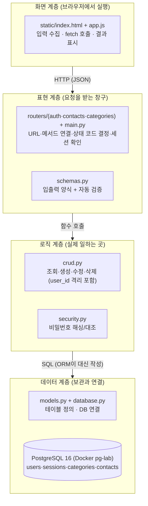
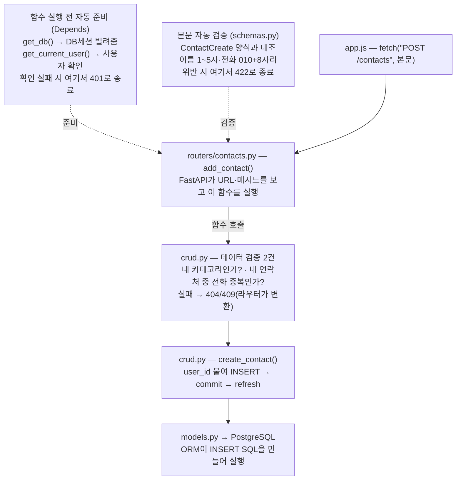

# 연락처 관리 웹 서비스 — 기능 정의서 (2차 과제)

| 항목 | 내용 |
|---|---|
| 문서명 | 연락처 관리 웹 서비스(2차 과제) 기능 정의서 |
| 문서 유형 | Function Definition (Functional Specification) |
| 과제 구분 | 2차 과제 — FastAPI + DB 연락처 프로그램 |
| 선행 과제 | 1차 과제 — 콘솔 연락처 관리 프로그램 |
| 버전 | v1.3 |
| 언어/환경 | Python 3.12+ / FastAPI 0.139.0 / SQLAlchemy 2.0.51 / PostgreSQL 16 |
| 상태 | 확정(Baseline) |

**이 문서의 역할(안내)** 프로그램을 구성하는 각 기능을 파일(모듈)과 함수 단위로 정의합니다. 구현요구사항(01 문서)이 "무엇을"이라면, 본 문서는 "그 일을 어느 파일의 어떤 함수가 하는가"를 다룹니다. 1차 과제는 파일 1개(`member_manager.py`)에 함수 13개였지만, 2차 과제는 역할별로 파일을 나눕니다 — 이 "나누는 기준"을 이해하는 것이 본 문서의 절반입니다.

**버전 관리 방침**: 이 문서(md)가 기능정의서의 정식 소스 오브 트루스입니다. 원본 PDF(v1.0)는 `docs/planning/old/03_연락처관리_웹서비스_기능정의서_v1.0.pdf`로 이동 보존되어 있습니다(더 이상 갱신 안 함). 내용이 바뀔 때마다 PDF를 재변환하지 않고, 이 md 파일의 버전(v1.1, v1.2, ...)만 올려서 관리하고 참조합니다.

> **변경 이력**
> - **v1.3 (2026-07-15)**: 사용자 승인 하에 §1-1 "폴더/파일 구성" 트리의 이름 체계를 `tech-architecture.md` §1-1·05 TRD §3과 통일했습니다. 옛 `contact_app/` 단일 루트 구조(main.py·routers/·static/을 `backend/` 래퍼 없이 평평하게 배치)를 프로젝트 루트 + `backend/`·`static/`·`frontend/` 형제 구조로 교체했습니다. 03 원본의 파일별 설명 주석(예: "DB 연결: 엔진, DB세션 공장, get_db")은 그대로 보존했고(Surgical Changes — 설명 스타일 자체는 바꾸지 않음), 원본에 없던 `requirements.txt`·`frontend/`는 canonical 구조에 실재하는 항목이라 신규 반영했습니다(각주는 05 TRD §3 문구 재사용). §1-1 외 다른 절(§1-2~§7)은 `contact_app` 관련 문자열이 없어 변경하지 않았습니다(전수 확인 완료). 근거: `docs/planning/tech-architecture.md` §1-1(2026-07-15 갱신분).
> - **v1.2 (2026-07-14)**: 사용자 결정으로 "비밀번호 찾기" → "비밀번호 재설정" 명칭을 통일했습니다. §2 기능 목록 FN-014 행을 "아이디 존재 확인 (비밀번호 찾기 1단계)" → "아이디 존재 확인 (비밀번호 재설정 1단계)"로 정정, §4 FN-003 스키마 표의 `FindPasswordIn`/`FindPasswordOut` 설명 문구를 "비밀번호 재설정 1단계 입력/응답"으로 통일(클래스명 자체는 코드 식별자라 변경 없음), §4 FN-014 소제목의 "비밀번호 찾기 1단계"를 "비밀번호 재설정 1단계"로, FN-014 상세 표의 crud.py 함수 설명 문구("비밀번호 찾기는 애초에...")도 같은 원칙으로 "비밀번호 재설정은 애초에..."로 정리했습니다. §4 FN-015 소제목은 단순 치환 시 "비밀번호 재설정 — 비밀번호 재설정 2단계"처럼 단어가 중복되므로, FN-015가 실제로 하는 일(새 비밀번호 저장)을 반영해 "비밀번호 재설정 2단계 — 새 비밀번호 저장"으로 정리했습니다. 근거: `docs/planning/service-concept.md` §3-3. §1/§3/§5/§6/§7에는 "비밀번호 찾기" 문자열이 없어 변경하지 않았습니다. 과거 v1.1 로그는 그대로 둡니다.
> - **v1.1 (2026-07-14)**: PDF(v1.0) → md 최초 전환. 사용자 승인 하에 진행된 정합화 라운드로서, `docs/planning/tech-architecture.md`(FR-14/FR-15 API 계약, §4)를 이 문서의 파일·함수 단위 스펙으로 구체화했습니다: ① §2 기능 목록에 FN-014(아이디 존재 확인)·FN-015(비밀번호 재설정) 행 추가, ② FN-003 스키마 표에 `FindPasswordIn`·`FindPasswordOut`·`ResetPasswordIn` 3개 행 추가, ③ §4 기능 상세 정의에 FN-014/FN-015 신규 절 추가(crud 함수·라우터 함수·처리 순서), ④ §7 기능-요구사항 매핑에 FN-014,015 → FR-14~15 → SCR-004 행 추가. 기존 FN-001~013 행과 문구는 변경하지 않았습니다(surgical). §1-2/§3의 다이어그램 이미지는 md 전환 과정에서 원본 내용 그대로 Mermaid flowchart로 재작성했습니다.
>   - **위치 정정 안내**: 작업 지시서는 "§3 스키마 표"라고 표기했으나, 문서 원문을 직접 확인한 결과 최상위 §3은 "전체 워크플로우 — 요청 1건의 함수 호출 관계"이고, 스키마 표는 §4 기능 상세 정의 안의 "FN-003 · 입출력 양식 + 자동 검증(schemas.py)" 절에 있습니다. 신규 3개 행은 실제 위치인 FN-003 절 표에 추가했습니다(ID를 추측 없이 원문 확인 후 배정하는 원칙에 따름).
> - **v1.0 (원본 PDF)**: 최초 확정본. 상세 변경 이력 없음(PDF 원본).

---

## 1. 프로젝트 구조 (파일 아키텍처)

### 1-1. 폴더/파일 구성

프로젝트 루트에는 `backend/`(Python 백엔드 코드)·`static/`(실제로 서빙되는 화면 코드)·`frontend/`(프론트엔드 작업 하네스 전용, 런타임 코드 없음)가 형제 폴더로 나란히 위치합니다.

```
(프로젝트 루트)
├── backend/
│   ├── main.py                  # 앱 조립: FastAPI 생성, 라우터 등록, 화면 제공
│   ├── database.py              # DB 연결: 엔진, DB세션 공장, get_db
│   ├── models.py                # 테이블 정의: User, LoginSession, Category, Contact
│   ├── schemas.py                # 입출력 양식: Pydantic 모델 (검증 규칙의 집)
│   ├── security.py               # 비밀번호 해싱: hash_password, verify_password
│   ├── crud.py                  # DB 작업 함수: 조회/생성/수정/삭제 (핵심 로직)
│   ├── routers/
│   │    ├── auth.py              # 인증 엔드포인트 4개 + get_current_user 의존성
│   │    ├── contacts.py          # 연락처 엔드포인트 4개
│   │    └── categories.py        # 카테고리 엔드포인트 4개
│   └── requirements.txt         # 의존성 패키지 목록
├── static/
│   ├── index.html               # 화면 (02 문서의 SCR-001~003)
│   └── app.js                   # 화면 동작 (fetch 호출, DOM 갱신)
└── frontend/
    └── CLAUDE.md                # frontend-engineer 작업 가이드(하네스 전용)*
```

\* `frontend/`는 이 프로젝트의 실제 화면 코드가 위치하는 곳이 아닙니다 — frontend-engineer가 작업할 때 참고하는 가이드 문서(`CLAUDE.md`)만 있고, 런타임에 실행되거나 서빙되는 코드는 없습니다. 실제로 편집·서빙되는 화면 코드는 `static/index.html`·`static/app.js`입니다.

### 1-2. 왜 이렇게 나누나 — 계층 아키텍처



> **다이어그램 변환 안내(v1.1)**: 원본(v1.0)은 이 절을 이미지로 제공했습니다. md 전환 과정에서 Mermaid flowchart로 재작성했으며, 원본 이미지의 내용만 그대로 옮겼습니다.

> **비유로 이해하기 — "식당의 부서"**: 1차 과제는 사장 혼자 주문·조리·창고를 다 하는 가게였습니다(파일 1개). 2차 과제는 홀(routers) — 주방(crud) — 창고(models/DB)로 부서를 나눈 식당입니다. 홀 직원은 요리하지 않고(라우터에 DB 코드 금지), 주방장은 손님을 직접 상대하지 않습니다(crud에 상태 코드 결정 금지). 부서를 나누는 이유는 1차 때와 같습니다 — 고칠 때 한 곳만 고치기 위해서. 나중에 화면을 앱으로 바꿔도 주방(crud)은 그대로 씁니다.

### 1-3. ⚠️ 용어 주의 — "세션"이 두 가지다 (초보자 최다 혼동 지점)

2차 과제에는 이름이 같은 별개 개념이 두 개 등장합니다. 반드시 구분하세요.

| 구분 | 정체 | 어디서 오나 | 코드에서의 이름 |
|---|---|---|---|
| DB 세션 | 파이썬 ↔ DB 사이의 대화 연결 (요청마다 열고 닫음) | SQLAlchemy | `Session`, `db: Session = Depends(get_db)` |
| 로그인 세션 | "누가 로그인 중인가"를 적어 둔 장부의 행 | 우리가 만든 `sessions` 테이블 | 모델 클래스 `LoginSession` |

> 이 충돌 때문에 로그인 세션의 모델 클래스 이름을 `Session`이 아니라 `LoginSession`으로 정합니다(테이블명은 `sessions` 그대로). `from sqlalchemy.orm import Session`과 이름이 겹치면 임포트 순서에 따라 한쪽이 덮여 찾기 어려운 버그가 나기 때문입니다. "이름 충돌을 이름 짓기로 피한다" — 실무에서 매우 자주 쓰는 기법입니다.

---

## 2. 기능 목록 (Function Inventory)

| 기능 ID | 기능명 | 위치(파일) | 대표 함수/객체 | 관련 FR |
|---|---|---|---|---|
| FN-001 | DB 연결과 DB세션 공급 | database.py | `engine`, `get_db()` | 전체 |
| FN-002 | 테이블 모델 정의 | models.py | `User`, `LoginSession`, `Category`, `Contact` | §1 데이터 모델 |
| FN-003 | 입출력 양식 + 자동 검증 | schemas.py | `SignupIn`, `ContactCreate`, `ContactUpdate`, `ContactOut` 등 | 유효성 규칙 |
| FN-004 | 비밀번호 해싱/대조 | security.py | `hash_password()`, `verify_password()` | FR-01, FR-02 |
| FN-005 | 회원가입 처리 | crud.py + routers/auth.py | `create_user()` (+기본 카테고리 시드) | FR-01 |
| FN-006 | 로그인·세션 발급 | crud.py + routers/auth.py | `authenticate_user()`, `create_login_session()` | FR-02 |
| FN-007 | 현재 사용자 확인 (의존성) | routers/auth.py | `get_current_user()` | FR-04 + 모든 보호 API |
| FN-008 | 로그아웃·세션 삭제 | crud.py + routers/auth.py | `delete_login_session()` | FR-03 |
| FN-009 | 연락처 CRUD | crud.py | `list_contacts()`, `create_contact()`, `get_my_contact()`, `update_contact()`, `delete_contact()` | FR-05~08 |
| FN-010 | 카테고리 CRUD + 사용 중 확인 | crud.py | `list_categories()`, `create_category()`, `update_category()`, `delete_category()`, `count_contacts_in_category()` | FR-09~12 |
| FN-011 | 엔드포인트 정의 (창구) | routers/ 3개 파일 | `@router.get/post/patch/delete` 함수 12개 | FR-01~12 |
| FN-012 | 화면 제공 + 화면 동작 | main.py + static/ | `GET /` → index.html, app.js | FR-13 |
| FN-013 | 예외 → 상태 코드 변환 | routers/ 전반 | `HTTPException(status_code, detail)` | NFR-01 |
| FN-014 | 아이디 존재 확인 (비밀번호 재설정 1단계) | crud.py + routers/auth.py | `get_user_by_username()`, `find_password()` | FR-14 |
| FN-015 | 비밀번호 재설정 (2단계, 세션 전체 무효화 포함) | crud.py + routers/auth.py | `reset_password()`, `reset_password_endpoint()` | FR-15 |

> **FN-014/FN-015 신설(v1.1)**: PRD v1.1의 UC-09, 01 문서 v1.1의 FR-14/FR-15에 대응합니다. 근거: `docs/planning/tech-architecture.md` §4.

**1차 과제와의 대응**: 1차의 `load_data`/`save_data`는 FN-001(DB 연결)로, `validate_*` 3형제는 FN-003(schemas)으로, `find_by_name`은 FN-009의 `list_contacts(name=...)`로 흡수됩니다. 완전히 새로운 것은 FN-004(해싱), FN-006~008(세션), FN-007(현재 사용자 확인) 뿐입니다.

---

## 3. 전체 워크플로우 — 요청 1건의 함수 호출 관계

"연락처 추가" 요청 1건이 어떤 파일의 어떤 함수를 순서대로 거치는지의 전체 지도입니다. (1차 과제 문서의 "기능 아키텍처 — 함수 호출 관계"에 대응)



> 응답은 역순으로: PostgreSQL → crud(연락처 객체) → 라우터(ContactOut 양식으로 변환) → 201 JSON → app.js(목록 새로 고침)
>
> **다이어그램 변환 안내(v1.1)**: 원본(v1.0)은 이 절을 이미지로 제공했습니다. md 전환 과정에서 Mermaid flowchart로 재작성했으며, 원본 이미지의 내용만 그대로 옮겼습니다.

> **초보자 포인트 — Depends(의존성 주입)**: 라우터 함수의 매개변수에 `db: Session = Depends(get_db)`, `user: User = Depends(get_current_user)`라고 적으면, FastAPI가 함수를 실행하기 전에 준비물을 자동으로 챙겨서 넣어 줍니다. 요리사(함수)가 일 시작 전에 조수(FastAPI)가 재료(DB세션)와 주문서 확인(로그인 사용자)을 끝내 주는 것과 같습니다. 1차 과제에서 main 루프가 매번 직접 하던 준비 작업이, 2차에서는 선언 한 줄로 자동화됩니다. 준비에 실패하면(로그인 안 됨) 본 함수는 아예 실행되지 않고 401이 나갑니다 — 그래서 12개 API 어디에도 "로그인 확인 코드"를 반복해서 쓸 필요가 없습니다.

---

## 4. 기능 상세 정의

### FN-001 · DB 연결과 DB세션 공급 (database.py)

| 항목 | 내용 |
|---|---|
| 구성 | `engine`(연결 담당), `SessionLocal`(DB세션 공장), `Base`(모델 부모), `get_db()`(의존성) |
| get_db() 동작 | 요청마다 DB세션을 열어 빌려주고(`yield`), 요청이 끝나면 반드시 닫음(`finally`) |
| 접속 문자열 | `postgresql+psycopg://`로 시작 (드라이버 psycopg 3) — 상세는 05 TRD |
| 1차 대응 | `load_data`/`save_data`가 하던 "저장소 연결" 역할 |
| 예외 | DB(pg-lab)가 꺼져 있으면 연결 오류 → 실행 전 Docker 기동 확인 |

### FN-002 · 테이블 모델 정의 (models.py)

| 항목 | 내용 |
|---|---|
| 클래스 | `User`, `LoginSession`(§1-3 참조), `Category`, `Contact` — 01 문서 §1-2의 4개 테이블과 1:1 |
| 문법 | SQLAlchemy 2.0 방식 `Mapped[...]` + `mapped_column(...)` |
| 제약 표현 | `unique=True`(username), `ForeignKey(...)`, 복합 UNIQUE는 `UniqueConstraint("user_id", "phone")` |
| 출력 | 클래스 정의가 곧 테이블 설계도 — 앱 시작 시 테이블 자동 생성 (방법은 05 TRD) |

### FN-003 · 입출력 양식 + 자동 검증 (schemas.py)

| 스키마 | 용도 | 담는 규칙 (01 문서 §4-1과 동일) |
|---|---|---|
| SignupIn | 가입/로그인 입력 | username 4~20자·`^[a-z0-9]+$` / password 4~20자 |
| UserOut | 사용자 응답 | id, username만 — password_hash는 절대 포함 금지 |
| ContactCreate | 연락처 추가 입력 | name 1~5자 / phone `^010\d{8}$` / addr 자유 / category_id |
| ContactUpdate | 연락처 수정 입력 | 위와 같은 규칙, 단 모든 필드가 선택(`\| None`) — 보낸 것만 수정(PATCH) |
| ContactOut | 연락처 응답 | id, name, phone, addr, category_id, category_name |
| ContactListOut | 목록 응답 | total, items(ContactOut 배열) — 1차의 "총 N명" 계승 |
| CategoryCreate/Update | 카테고리 입력 | name 1~10자 |
| CategoryOut | 카테고리 응답 | id, name |
| FindPasswordIn | 비밀번호 재설정 1단계 입력 | username 4~20자·`^[a-z0-9]+$` (SignupIn.username과 동일 규칙 재사용) |
| FindPasswordOut | 비밀번호 재설정 1단계 응답 | username만 echo — id는 포함하지 않음(최소 정보 노출 원칙) |
| ResetPasswordIn | 비밀번호 재설정 입력 | username(위와 동일 규칙) + new_password 4~20자(SignupIn.password와 동일 규칙 재사용) |

> **스키마 3종 신설(v1.1)**: `FindPasswordIn`/`FindPasswordOut`/`ResetPasswordIn`. 근거: `docs/planning/tech-architecture.md` §4. 새 정규식을 만들지 않고 `SignupIn`의 규칙을 그대로 재사용합니다(Simplicity First).

> 입력용과 출력용을 왜 나누나: 입력 양식에 id가 있으면 사용자가 id를 마음대로 지정해 보낼 수 있고, 출력 양식에 password_hash가 있으면 해시가 응답에 노출됩니다. "받을 것"과 "보여줄 것"은 항상 다른 양식으로 — 실무 API 설계의 철칙입니다.

### FN-004 · 비밀번호 해싱/대조 (security.py)

| 함수 | 입력 | 출력 | 설명 |
|---|---|---|---|
| hash_password(원문) | 비밀번호 원문 | 해시 문자열 | pwdlib(Argon2)로 변환 — 가입 시 1회 |
| verify_password(원문, 해시) | 로그인 입력값, 저장된 해시 | True/False | 로그인 때마다 대조 |

> 파일을 따로 두는 이유: "비밀번호 다루는 코드가 여기 다 있다"를 보장하기 위해서입니다. 나중에 해싱 방식을 바꿔도 이 파일만 고치면 됩니다.

### FN-005 · 회원가입 처리 (crud.py `create_user`)

| 항목 | 내용 |
|---|---|
| 처리 순서 | ① username 중복 확인(있으면 라우터가 409) ② hash_password로 해시 ③ User INSERT ④ 같은 커밋 안에서 기본 카테고리 3개(가족/친구/기타) INSERT ⑤ commit |
| 왜 같은 커밋인가 | 사용자만 만들어지고 카테고리 생성이 실패하면 "카테고리 없는 반쪽 계정"이 남음 → 한 트랜잭션으로 묶으면 둘 다 되거나 둘 다 안 되거나만 존재 (1차 과제에는 없던, DB만이 주는 안전장치) |

### FN-006 · 로그인·세션 발급 (crud.py + routers/auth.py)

| 함수 | 처리 |
|---|---|
| authenticate_user(db, username, password) | 사용자 조회 → verify_password 대조 → 성공 시 User, 실패 시 None (없는 아이디/틀린 비번 구분 없이 — 01 문서 보안 규칙) |
| create_login_session(db, user_id) | secrets.token_hex(32)로 세션 번호 생성 → sessions INSERT + commit → 번호 반환 |
| 라우터 마무리 | `response.set_cookie("session_id", 번호, httponly=True)` — httponly는 JavaScript가 쿠키를 읽지 못하게 하는 보호 옵션 |

### FN-007 · 현재 사용자 확인 — `get_current_user()` ★ 2차 과제의 심장

이 함수 하나가 보호 API 8개 전부의 문지기입니다.

| 항목 | 내용 |
|---|---|
| 시그니처 | `get_current_user(session_id: str \| None = Cookie(default=None), db: Session = Depends(get_db)) -> User` |
| 사용법 | 보호할 라우터 함수에 `user: models.User = Depends(get_current_user)` 한 줄 추가 — 끝 |
| 1차 대응 | (없음 — 2차의 완전 신규 개념이자, 멀티 유저를 가능하게 하는 단 하나의 함수) |

### FN-008 · 로그아웃 (crud.py `delete_login_session`)

| 항목 | 내용 |
|---|---|
| 처리 | sessions에서 해당 행 DELETE + commit → 라우터가 `response.delete_cookie("session_id")` |
| 결과 | 같은 쿠키로 다시 요청해도 FN-007 ②에서 걸려 401 — "장부에서 지우면 카드는 즉시 무효" |

### FN-009 · 연락처 CRUD (crud.py)

모든 함수의 첫 번째 규칙: 조회 조건에 user_id가 반드시 들어간다.

| 함수 | 입력 | 처리 | 출력 |
|---|---|---|---|
| list_contacts(db, user_id, name=None, category_id=None) | 검색어(선택) | 내 연락처 SELECT (+이름/카테고리 필터) | Contact 리스트 |
| get_my_contact(db, user_id, contact_id) | 대상 id | `WHERE id=? AND user_id=?`로 조회 | Contact 또는 None(→라우터가 404) |
| create_contact(db, user_id, data) | ContactCreate | user_id 붙여 INSERT + commit + refresh | 생성된 Contact |
| update_contact(db, contact, data) | 대상 + ContactUpdate | `model_dump(exclude_unset=True)`로 보낸 항목만 갱신 + commit | 수정된 Contact |
| delete_contact(db, contact) | 대상 | DELETE + commit | 없음 |

> get_my_contact가 데이터 격리의 전부입니다. 조건에 user_id가 함께 들어가므로, 남의 연락처는 id가 맞아도 조회 결과가 None → 라우터는 "없다(404)"고만 답합니다. 별도의 권한 검사 코드가 필요 없는, 가장 단순하고 안전한 구조입니다.

### FN-010 · 카테고리 CRUD (crud.py)

연락처와 같은 패턴 + 함수 하나 추가:

| 함수 | 역할 |
|---|---|
| count_contacts_in_category(db, user_id, category_id) | 그 카테고리 소속 연락처 수를 셈 — 삭제 전 필수 호출, 1건 이상이면 라우터가 409(건수를 detail에 포함) |

### FN-011 · 엔드포인트 정의 (routers/ — 창구 12개)

라우터 함수는 "접수 → 확인 → 주방 호출 → 응답 포장"만 합니다. 표준형:

```python
# 모든 라우터 함수의 공통 골격 (연락처 추가 예)
@router.post("", response_model=schemas.ContactOut, status_code=201)
def add_contact(
    data: schemas.ContactCreate,                        # 본문 → 자동 검증(422)
    user: models.User = Depends(get_current_user),      # 문지기(401)
    db: Session = Depends(get_db),                       # DB세션 준비
):
    ... # 데이터 검증(404/409) 후 crud 호출, 결과 반환
```

| 파일 | 담는 창구 | 개수 |
|---|---|---|
| routers/auth.py | signup, login, logout, me | 4 |
| routers/contacts.py | 목록/검색, 추가, 수정, 삭제 | 4 |
| routers/categories.py | 목록, 추가, 수정, 삭제 | 4 |

### FN-012 · 화면 제공 + 화면 동작 (main.py + static/)

| 항목 | 내용 |
|---|---|
| main.py | FastAPI 앱 생성, 라우터 3개 등록, `GET /` → index.html 반환 |
| index.html | 02 문서의 SCR-001~003 구조 그대로 |
| app.js | 02 문서 §5의 단계별 워크플로우(me → categories → contacts) 구현 + 버튼 이벤트 |

### FN-013 · 예외 → 상태 코드 변환 (라우터 전반)

| 상황 | 코드 패턴 | 결과 |
|---|---|---|
| crud가 None 반환 (없거나 남의 것) | `raise HTTPException(404, "해당 연락처가 없습니다")` | 404 + detail |
| 중복 발견 | `raise HTTPException(409, "이미 등록된 전화번호입니다")` | 409 + detail |
| 사용 중 카테고리 삭제 | `raise HTTPException(409, f"...연락처가 {n}건 있어 삭제할 수 없습니다...")` | 409 + detail |
| 형식 위반 | (코드 없음 — Pydantic 자동) | 422 |
| 미로그인 | (코드 없음 — FN-007이 처리) | 401 |

### FN-014 · 아이디 존재 확인 — 비밀번호 재설정 1단계 (crud.py + routers/auth.py) (신규, v1.1)

**배경**: 01 문서 v1.1 FR-14(`POST /auth/find-password`)의 파일·함수 단위 구현 스펙입니다. 근거: `docs/planning/tech-architecture.md` §4.

| 항목 | 내용 |
|---|---|
| crud.py 함수 | `get_user_by_username(db, username) -> User \| None` — username으로 users 테이블을 조회. FN-006 `authenticate_user`가 내부적으로 하는 사용자 조회와 같은 조건이지만, 비밀번호 대조 없이 존재 여부만 확인하는 별도 함수로 분리(비밀번호 재설정은 애초에 비밀번호를 모르는 상태에서 호출되므로 대조 자체가 불가능) |
| routers/auth.py 함수 | `find_password(data: schemas.FindPasswordIn, db: Session = Depends(get_db)) -> schemas.FindPasswordOut` |
| 처리 순서 | ① `data.username` 형식은 Pydantic(`FindPasswordIn`)이 자동 검증(422) ② `get_user_by_username(db, data.username)` 호출 ③ None이면 `HTTPException(404, "존재하지 않는 아이디입니다")` ④ 있으면 `{"username": data.username}` 반환(FindPasswordOut) |
| Depends 여부 | `get_current_user` 미사용 — 로그인 불필요 API(01 문서 §2 공통 규칙 예외 목록) |
| 1차 대응 | (없음 — 2차의 신규 기능) |

### FN-015 · 비밀번호 재설정 2단계 — 새 비밀번호 저장 (crud.py + routers/auth.py) (신규, v1.1)

**배경**: 01 문서 v1.1 FR-15(`PATCH /auth/password`)의 파일·함수 단위 구현 스펙입니다. 근거: `docs/planning/tech-architecture.md` §4.

| 항목 | 내용 |
|---|---|
| crud.py 함수 | `reset_password(db, user: models.User, new_password: str) -> None` — ① `hash_password(new_password)`로 해시 ② `user.password_hash` 갱신 ③ 같은 트랜잭션에서 `LoginSession` 중 `user_id`가 일치하는 행 전부 DELETE ④ commit |
| routers/auth.py 함수 | `reset_password_endpoint(data: schemas.ResetPasswordIn, db: Session = Depends(get_db)) -> dict` |
| 처리 순서 | ① `data.username`/`data.new_password` 형식은 Pydantic(`ResetPasswordIn`)이 자동 검증(422) ② `get_user_by_username(db, data.username)` 재사용(FN-014와 동일 함수) 호출 ③ None이면 `HTTPException(404, "존재하지 않는 아이디입니다")` ④ 있으면 `crud.reset_password(db, user, data.new_password)` 호출 ⑤ `{"message": "비밀번호가 변경되었습니다"}` 반환 |
| Depends 여부 | `get_current_user` 미사용 — 로그인 불필요 API |
| 세션 무효화 이유 | 비밀번호가 바뀌면 그 이전에 발급된 세션은 더 이상 "본인이 확인한 자격"을 대변하지 않으므로 강제 재로그인을 요구한다. `docs/planning/service-concept.md` §3의 트레이드오프("아이디만 알면 누구나 비밀번호를 바꿀 수 있다")를 뒤집지는 않지만, 공격자가 비밀번호를 바꿔도 원래 사용자의 기존 세션이 자동으로 함께 끊기게 하는 보완책이다 |
| 1차 대응 | (없음 — 2차의 신규 기능) |

---

## 5. 기능 우선순위 및 구현 순서 (권장)

1차 과제의 "골격 먼저, 견고성 마지막" 원칙 그대로입니다. 00 문서의 학습 6단계와 일치합니다.

| 순서 | 구현 대상 (FN) | 완료 확인 | 이유 |
|---|---|---|---|
| 1 | FN-001 DB 연결 + FN-002 모델 | 테이블 4개 생성 확인 (psql) | 보관소가 있어야 나머지를 붙임 |
| 2 | FN-003 스키마 + FN-004 해싱 | (다음 단계에서 함께 확인) | 창구·주방의 공용 부품 |
| 3 | FN-005~008 인증 4종 + FN-007 문지기 | /docs에서 가입→로그인→me→로그아웃 | 문지기가 있어야 이후 모든 API를 보호 상태로 개발 |
| 4 | FN-009 + contacts 라우터 | /docs에서 CRUD + 계정 2개 격리 확인 | 핵심 데이터 먼저 |
| 5 | FN-010 + categories 라우터 | 사용 중 삭제 409 확인 | 같은 패턴 반복 + 엣지 케이스 |
| 6 | FN-012 화면 | 브라우저에서 전 기능 동작 | API가 다 검증된 뒤 화면을 얹음 |
| 7 | FN-013 예외 마감 | 01 문서 §5-3 목록 전부 통과 | 견고성 마무리 |

---

## 6. 기능 점검 체크리스트

- [ ] FN-001: pg-lab이 켜진 상태에서 서버가 오류 없이 시작
- [ ] FN-002: users·sessions·categories·contacts 테이블 4개 생성 확인
- [ ] FN-005: 가입 직후 그 사용자의 카테고리가 정확히 3개(가족/친구/기타)
- [ ] FN-006: 로그인 응답에 Set-Cookie가 있고, 이후 요청에 쿠키가 자동 첨부됨
- [ ] FN-007: 쿠키 없이/엉터리 쿠키로 보호 API 호출 시 401
- [ ] FN-008: 로그아웃 후 같은 쿠키로 요청 시 401
- [ ] FN-009: 계정 2개로 서로의 연락처가 보이지 않음 + 남의 id 접근 시 404
- [ ] FN-009: 같은 번호 두 번 추가 시 409, PATCH는 보낸 항목만 바뀜
- [ ] FN-010: 소속 연락처가 있는 카테고리 삭제 시 409 + 건수 안내
- [ ] FN-011: /docs에 창구 12개가 전부 보이고 실행 가능
- [ ] FN-012: 브라우저 화면에서 로그인부터 관리까지 전 기능 동작
- [ ] FN-013: 어떤 요청에도 500이 나지 않음

---

## 7. 기능–요구사항 매핑

| FN | FR | SCR (02 문서) | 00 문서 학습 목표 |
|---|---|---|---|
| FN-001, 002 | §1 데이터 모델 | - | 3-2 테이블, 3-7 FK |
| FN-003 | §4 유효성 | - | 3-4 자동 검증 |
| FN-004~008 | FR-01~04 | SCR-001 | 3-6 세션 로그인 |
| FN-009 | FR-05~08 | SCR-002 | 3-1 REST API |
| FN-010 | FR-09~12 | SCR-003 | 3-7 카테고리(FK) |
| FN-011 | FR-01~12 | 전체 | 3-1 REST API |
| FN-012 | FR-13 | SCR-001~003 | 3-5 프론트-백 연동 |
| FN-013 | NFR-01 | SCR-900 | 평가 관점(예외) |
| FN-014, 015 | FR-14~15 | SCR-004 | 3-6 세션 로그인 |

> **FN-014,015 행 신설(v1.1)**: PRD v1.1 UC-09, 01 문서 v1.1 FR-14~15, 화면정의서 SCR-004에 대응. 근거: `docs/planning/tech-architecture.md` §4, `docs/planning/service-concept.md` §3-1.
