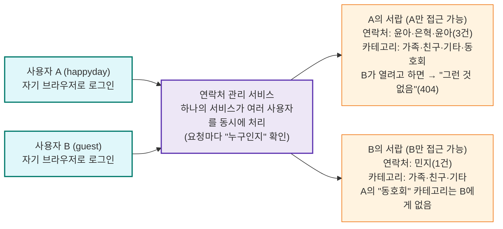
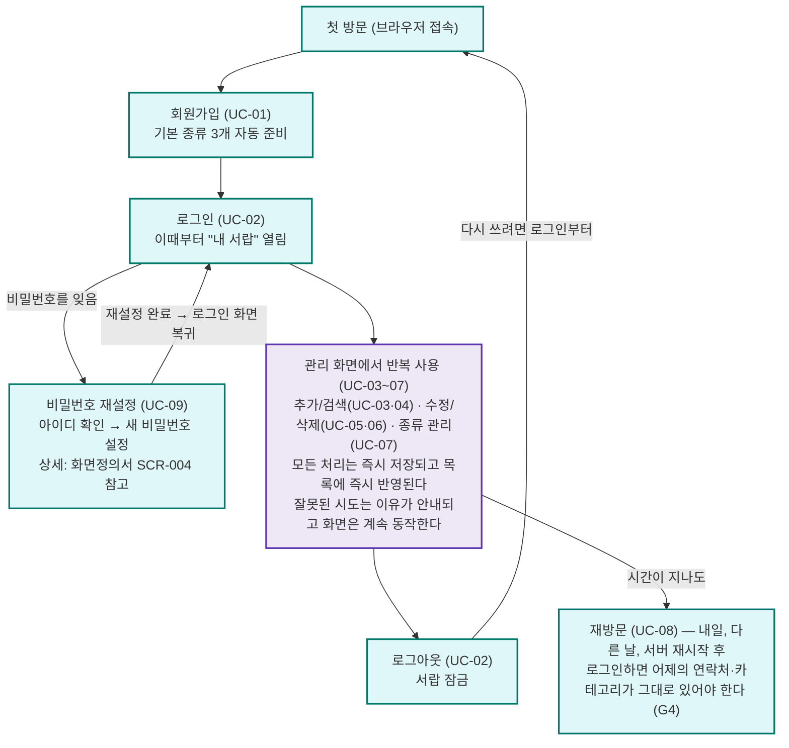
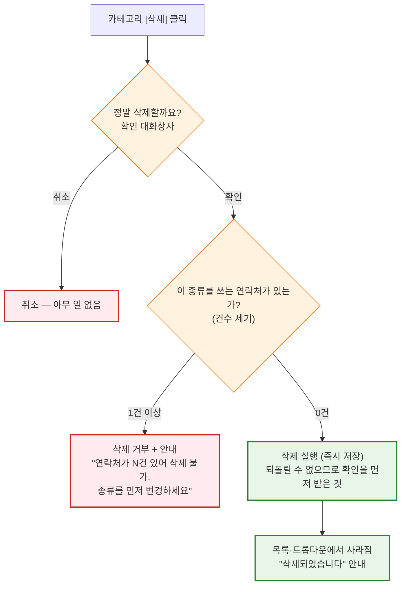

# 연락처 관리 웹 서비스 — PRD (제품 요구사항 정의서) (2차 과제)

| 항목 | 내용 |
|---|---|
| 문서명 | 연락처 관리 웹 서비스(2차 과제) PRD |
| 문서 유형 | Product Requirements Document |
| 과제 구분 | 2차 과제 — FastAPI + DB 연락처 프로그램 |
| 선행 과제 | 1차 과제 — 콘솔 연락처 관리 프로그램 |
| 버전 | v1.3 |
| 제품 단계 | 교육용 과제 (학습 산출물) |
| 상태 | 확정(Baseline) |

**PRD란?(안내)** PRD는 "사용자 입장에서 이 제품이 무엇을 해줘야 하는가"를 정의하는 문서입니다. "어떻게 만드는가(기술)"는 다루지 않습니다 — 그건 TRD(05 문서)의 몫입니다. 그래서 이 문서에는 FastAPI·SQLAlchemy 같은 기술 이름이 거의 나오지 않고, 대신 "사용자는 ~할 수 있어야 한다"는 문장이 나옵니다.

실무에서는: 기획자(PM)가 PRD를 쓰고, 개발자가 그것을 TRD와 코드로 옮깁니다. 개발자가 PRD를 읽는 능력은 "기획 의도를 정확히 구현하는 능력"이라서, 신입 개발자 온보딩에서 가장 먼저 요구되는 소양 중 하나입니다. 이번 과제에서 여러분은 두 역할을 다 경험합니다.

**버전 관리 방침**: 이 문서(md)가 PRD의 정식 소스 오브 트루스입니다. 원본 PDF(v1.0)는 `docs/planning/old/04_연락처관리_웹서비스_PRD_v1.0.pdf`로 이동 보존되어 있습니다(더 이상 갱신 안 함). 내용이 바뀔 때마다 PDF를 재변환하지 않고, 이 md 파일의 버전(v1.1, v1.2, ...)만 올려서 관리하고 참조합니다. PDF 재변환은 필요할 때 별도 요청 시에만(report-pdf 파이프라인) 진행합니다.

> **변경 이력**
> - **v1.3 (2026-07-14)**: 사용자 결정으로 "비밀번호 찾기" → "비밀번호 재설정" 명칭을 통일했습니다. §5 UC-09 행과 유스케이스 상세 ③ 제목·1단계 서술의 "비밀번호 찾기"를 "비밀번호 재설정"으로 정정(로그인 화면 링크 문구도 함께 동기화), §7 Mermaid PW 노드 텍스트의 "비밀번호 찾기 (UC-09)"를 "비밀번호 재설정 (UC-09)"으로, §9 AC-04 괄호 안·AC-18 첫 문장·"AC-04와 AC-18의 관계" 안내 문단의 "비밀번호 찾기"를 전부 "비밀번호 재설정"으로, §11 표 아래 각주의 "비밀번호 찾기/변경"을 "비밀번호 재설정"으로 통일했습니다. §5 유스케이스 상세 ③의 화면정의서 인용 파일명도 `02_..._v1.4.md` → `02_..._v1.5.md`로 동기화했습니다. §4/§7의 "다이어그램 변환 안내(v1.1)"·"다이어그램 갱신 안내(v1.2)" 블록과 과거 v1.0~v1.2 변경 이력은 각 라운드 당시 실제로 반영한 문구를 기록한 감사 블록이므로 보존했습니다. 근거: `docs/planning/service-concept.md` §3-3.
> - **v1.2 (2026-07-14)**: 사용자 요청으로 `service-concept.md` §3-1 (5) 결정을 재검토, §7 사용자 여정 다이어그램에 비밀번호 찾기(UC-09) 흐름을 요약 노드(PW)로 추가했습니다 — U2(로그인)에서 분기해 재설정 성공 시 U2로 재합류(SCR-004가 완료 후 SCR-001 로그인 화면으로 돌아가는 지점과 동일). §4 아키텍처 구조도(정적 구조도, 데이터 격리 목적)는 다이어그램 자체를 수정하지 않고 본문에 한 줄 각주만 추가했습니다. SCR-004의 세부 상태 분기(404/422 등)는 복제하지 않았습니다. 근거: `docs/planning/service-concept.md` §3-2.
> - **v1.1 (2026-07-14)**: PDF(v1.0) → md 최초 전환. 사용자 승인 하에 진행된 정합화 라운드(화면정의서 v1.3에 먼저 확정된 SCR-004 "비밀번호 찾기"를 PRD에 정식 반영)로서, `docs/planning/service-concept.md` §3-1(service-planner 브리프)을 그대로 반영했습니다: ① AC-04를 "로그인 시도(`POST /auth/login`) 응답에 한정"하는 문구로 교체(삭제·완화 아님) + AC-04·AC-18 관계 안내 문단 신설, ② N1 비목표에서 "비밀번호 찾기/변경" 문구 삭제(이메일 인증만 남김), ③ §11 향후 확장 표의 "비밀번호 변경/찾기" 행을 "본인 확인 강화(향후 확장)" 방향으로 갱신, ④ UC-09·PR-13·AC-18 신설(신설 번호는 PRD 원문을 직접 확인해 UC-08·PR-12·AC-17까지만 쓰이고 있음을 확인 후 배정). §4/§7/§8의 다이어그램 이미지는 md 전환 과정에서 원본 내용 그대로 Mermaid로 재작성했으며(브리프 §3-1 (5) 범위 밖이므로 비밀번호 찾기 흐름은 추가하지 않음), FR-14/FR-15는 브리프 (4) 권고에 따라 PRD에 번호로 직접 인용하지 않고 기존 §10 "01 문서를 단일 기준으로 따른다" 참조 패턴만 유지했습니다.
> - **v1.0 (원본 PDF)**: 최초 확정본. 상세 변경 이력 없음(PDF 원본).

---

## 1. 배경 및 문제 정의

연락처를 머릿속이나 종이, 개인 파일에 두면 잃어버리기 쉽고 검색·수정이 번거롭습니다. 1차 과제의 콘솔 프로그램이 이 문제를 한 번 풀었지만, 세 가지 한계가 남았습니다.

| 1차 과제의 한계 | 실제로 생기는 불편 |
|---|---|
| 그 컴퓨터, 그 터미널에서만 사용 가능 | 다른 기기·다른 장소에서 내 연락처를 볼 수 없음 |
| 사용자 구분이 없음 | 가족과 컴퓨터를 같이 쓰면 연락처가 섞임 — "내 것"이라는 개념 자체가 없음 |
| 종류가 3개로 고정 | "동호회", "거래처" 같은 내 방식의 분류를 만들 수 없음 |

2차 과제는 이 세 가지를 해결합니다: 브라우저만 있으면 어디서든 쓸 수 있고, 각자 로그인해서 자기 연락처만 관리하며, 분류를 직접 만들어 쓸 수 있는 연락처 관리 웹 서비스를 만듭니다. 동시에, 초보 개발자가 REST API·데이터베이스·인증·화면 연동이라는 실무 핵심 기술을 학습하는 교육 목적을 가집니다.

---

## 2. 목표와 비목표

### 2-1. 목표 (Goals)

- G1. 여러 사용자가 각자 가입/로그인하여 자기만의 연락처를 관리할 수 있다.
- G2. 연락처를 추가/조회(검색)/수정/삭제할 수 있고, 처리 결과가 화면에 즉시 반영된다.
- G3. 연락처 종류(카테고리)를 사용자가 직접 추가/수정/삭제할 수 있다.
- G4. 브라우저를 닫거나 서버를 재시작해도 데이터와 로그인 상태가 보존된다(영속화).
- G5. 잘못된 입력·요청에도 서비스가 멈추지 않고, 이유를 알 수 있는 안내를 보여준다(견고성).
- G6. 다른 사용자의 데이터는 어떤 방법으로도 보거나 고칠 수 없다(데이터 격리).

### 2-2. 비목표 (Non-Goals) — 이번에 만들지 않는 것

| ID | 범위 밖 항목 | 이유 |
|---|---|---|
| N1 | 이메일 인증(가입 시 이메일 확인, 인증 메일 발송 등) | SMTP 등 외부 발신 인프라가 필요해 이번 과제 범위를 넘음 — 확장은 §11 |
| N2 | 회원 간 연락처 공유, 관리자 기능 | 단일 사용자 소유 모델로 한정 |
| N3 | 모바일 앱, 반응형 최적화 | PC 브라우저 기준 화면 1종 |
| N4 | 실서버 배포, HTTPS | 로컬 개발 환경(127.0.0.1)으로 한정 |
| N5 | 사진·생일 등 추가 항목 | 1차 과제와 같은 4개 항목(이름/전화/주소/종류) 유지 |

> **N1 갱신 안내(v1.1)**: 원본(v1.0)은 N1에 "비밀번호 찾기/변경, 이메일 인증"을 함께 비목표로 뒀습니다. 이번 라운드에서 "비밀번호 찾기/변경"은 기능 범위에 포함되어(PR-13, UC-09, AC-18) 더 이상 비목표가 아니므로 N1에서 제거했고, "이메일 인증"만 N1으로 남았습니다. 근거: `docs/planning/service-concept.md` §3.

비목표를 적는 이유(실무 관점): 실무에서 프로젝트가 늦어지는 가장 흔한 원인은 "하는 김에 이것도"입니다. PRD에 안 만들 것을 명시해 두면, 개발 도중 범위가 불어나는 것(scope creep)을 문서 한 줄로 막을 수 있습니다.

---

## 3. 사용자 정의 (페르소나)

| 페르소나 | 설명 | 핵심 니즈 |
|---|---|---|
| 사용자 A (예: happyday) | 자기 연락처를 관리하려고 가입한 사람 | 빠른 추가·검색·수정·삭제, 내 데이터가 안전하고 나만 볼 수 있길 원함 |
| 사용자 B (예: guest) | A와 같은 서비스를 쓰는 다른 사람 | A와 완전히 동일 — 단, A의 데이터와 절대 섞이지 않아야 함 |
| 학습자(개발자) | 이 서비스를 만드는 초보 개발자 | 실무 도구의 동작 원리를 이해하고 응용력을 키우길 원함 |

1차 과제의 페르소나는 "운영자 1명"이었습니다. 2차에서 같은 니즈를 가진 사용자가 2명 이상이 된 것 — 이 한 줄의 차이가 로그인·격리라는 요구사항 전부를 만들어 냅니다. 그래서 이 문서의 인수 기준(§9)은 반드시 계정 2개로 검사합니다.

---

## 4. 제품 구성 (아키텍처 — 사용자 관점)

기술 구조가 아니라 "사용자 눈에 보이는 제품의 모양"입니다. 핵심은 같은 서비스, 분리된 서랍입니다.

> "같은 건물(서비스), 각자의 잠긴 서랍(데이터)" — 카테고리까지 사용자별로 분리된다는 점에 주의.

**주의 깊게 볼 것**: 카테고리도 서랍 안에 있습니다. A가 만든 "동호회" 카테고리는 B의 드롭다운에 나타나지 않습니다. "기본 3개(가족/친구/기타)"조차 각자의 사본입니다 — 그래서 A가 자기 "친구"를 "베프"로 바꿔도 B의 "친구"는 그대로입니다.

※ 로그인 실패·비밀번호 분실 시의 복구 경로는 이 구조도의 범위가 아닙니다(이 그림은 로그인 이후의 데이터 격리만 보여줍니다) — 순서 흐름은 §7을 참고하세요.

> **다이어그램 변환 안내(v1.1)**: 원본(v1.0)은 이 절을 이미지로 제공했습니다. md 전환 과정에서 Mermaid flowchart로 재작성했으며, 원본 이미지의 내용만 그대로 옮겼습니다(비밀번호 찾기 흐름은 이 절의 범위가 아니므로 추가하지 않음 — `docs/planning/service-concept.md` §3-1 (5) 참고).

> **다이어그램 갱신 안내(v1.2)**: 사용자 요청으로 `service-concept.md` §3-1 (5)의 결정을 재검토했습니다. 이 구조도는 로그인 이후의 데이터 격리를 보여주는 정적 구조도이므로 mermaid 다이어그램 자체에는 비밀번호 찾기 흐름을 추가하지 않았습니다. 대신 본문에 한 줄 각주로 §7 참고 안내를 추가했습니다. 순차적 사용자 여정으로서의 비밀번호 찾기 흐름은 §7에 반영되어 있습니다(근거: `docs/planning/service-concept.md` §3-2).

---

## 5. 유스케이스 (Use Cases)

| ID | 유스케이스 | 액터 | 트리거 |
|---|---|---|---|
| UC-01 | 회원가입 | 신규 방문자 | 가입 폼 제출 |
| UC-02 | 로그인 / 로그아웃 | 사용자 | 로그인 폼 제출 / 로그아웃 버튼 |
| UC-03 | 연락처 등록 | 로그인 사용자 | 추가 폼 제출 |
| UC-04 | 연락처 목록 조회·검색 | 로그인 사용자 | 관리 화면 진입 / 검색 버튼 |
| UC-05 | 연락처 수정 | 로그인 사용자 | 목록 행의 [수정] |
| UC-06 | 연락처 삭제 | 로그인 사용자 | 목록 행의 [삭제] |
| UC-07 | 카테고리 관리 (추가/수정/삭제) | 로그인 사용자 | 카테고리 영역 버튼 |
| UC-08 | 재방문 (데이터·로그인 유지 확인) | 기존 사용자 | 브라우저 재접속 |
| UC-09 | 비밀번호 재설정 | 아이디는 기억하지만 비밀번호를 잊은 사용자 | 로그인 화면의 "비밀번호 재설정" 링크 클릭 |

> **UC-09 신설(v1.1)**: `docs/planning/service-concept.md` §3-1 (4) 브리프 문구를 그대로 반영했습니다. PRD 원문 확인 결과 UC-08까지만 쓰이고 있어 UC-09가 실제로 비어 있는 번호임을 확인했습니다.

### 유스케이스 상세 ① — UC-03 (연락처 등록)

1차 과제 PRD가 UC-01(등록)을 상세화했던 것과 같은 위치의 대표 케이스입니다. 예외 단계(4a, 5a...)를 읽는 법에 익숙해지세요 — "정상 흐름 도중 이 지점에서 이런 일이 생기면 이렇게 한다"는 뜻입니다.

| 단계 | 행위 |
|---|---|
| 1 | 사용자가 추가 폼에 이름·전화번호·주소를 입력하고 종류를 드롭다운에서 고른다 |
| 2 | [추가]를 누르면 시스템이 입력 형식을 검사한다 |
| 2a (예외) | 형식 위반(이름 6자, 전화 형식 오류 등) → 어떤 항목이 왜 틀렸는지 안내, 입력값은 지우지 않는다 |
| 3 | 시스템이 "이미 저장한 번호인지"를 그 사용자의 연락처 안에서만 확인한다 |
| 3a (예외) | 중복 → "이미 등록된 전화번호입니다" 안내 |
| 4 | 연락처가 저장되고, 폼이 비워지며, 목록에 새 연락처가 나타난다 ("총 N건"도 +1) |

### 유스케이스 상세 ② — UC-07 중 카테고리 삭제 (2차 과제의 대표 엣지 케이스)

| 단계 | 행위 |
|---|---|
| 1 | 사용자가 카테고리 목록에서 [삭제]를 누른다 |
| 2 | "정말 삭제할까요?" 확인 대화상자가 뜨고, 사용자가 확인한다 |
| 3 | 시스템이 그 카테고리에 소속된 연락처 수를 센다 |
| 3a (예외) | 1건 이상 → "이 카테고리를 사용하는 연락처가 N건 있어 삭제할 수 없습니다. 연락처의 종류를 먼저 변경하세요." 안내. 아무것도 지워지지 않는다 |
| 4 | 0건이면 삭제되고, 카테고리 목록과 종류 드롭다운에서 사라진다 |

왜 이것이 대표 케이스인가: 1차 과제의 "동명이인"이 그랬듯, 이 케이스는 정상 기능만 만들면 반드시 놓치는 지점입니다. "지우면 그 종류였던 연락처들은 어떻게 되는데?"라는 질문을 스스로 던질 수 있는가 — 이것이 이번 과제가 기르려는 사고력입니다. (본 제품의 답: 고아 데이터를 만들 바에는 삭제를 거부하고 사용자에게 정리 방법을 안내한다.)

### 유스케이스 상세 ③ — UC-09 (비밀번호 재설정) (신규, v1.1)

화면정의서 SCR-004의 Mermaid 플로우(§4 참고, `docs/planning/02_연락처관리_웹서비스_화면정의서_v1.5.md`)와 1:1 대응하는 상세 단계입니다.

| 단계 | 행위 |
|---|---|
| 1 | 사용자가 로그인 화면에서 "비밀번호 재설정"을 클릭한다 |
| 2 | 1단계: 아이디만 입력하고 [확인]을 누른다 |
| 2a (예외) | 존재하지 않는 아이디 → "존재하지 않는 아이디입니다" 안내(404), 1단계 화면 유지 |
| 3 | 아이디가 확인되면 2단계(새 비밀번호 설정) 화면으로 전환된다 |
| 4 | 새 비밀번호를 2회 입력하고 [비밀번호 변경]을 누른다 |
| 4a (예외) | 화면에서 먼저 두 값이 같은지 검사 → 불일치 시 API 호출 없이 즉시 안내 |
| 4b (예외) | 서버 응답 실패(422 등) → 어떤 항목이 왜 틀렸는지 안내, 2단계 화면 유지 |
| 5 | 비밀번호가 변경되고 "비밀번호가 변경되었습니다" 안내 후 로그인 화면으로 돌아간다 |

상세 API 계약은 01 문서(구현요구사항서)를 따른다(§10 참조 패턴과 동일).

---

## 6. 기능 요구사항 (사용자 관점)

"사용자는 ~할 수 있어야 한다" 형식입니다. 각 항목이 어떤 목표(G)를 실현하는지 함께 적었습니다.

| ID | 요구사항 | 목표 | 우선순위 |
|---|---|---|---|
| PR-01 | 사용자는 아이디와 비밀번호로 가입할 수 있어야 한다 | G1 | 필수 |
| PR-02 | 사용자는 로그인/로그아웃할 수 있어야 하며, 로그인 없이는 어떤 데이터도 볼 수 없어야 한다 | G1·G6 | 필수 |
| PR-03 | 가입 직후에도 기본 종류(가족/친구/기타)가 준비되어 바로 연락처를 추가할 수 있어야 한다 | G2 | 필수 |
| PR-04 | 사용자는 연락처(이름/전화/주소/종류)를 추가할 수 있어야 한다 | G2 | 필수 |
| PR-05 | 사용자는 자기 연락처 전체와 총 건수를 볼 수 있어야 한다 | G2 | 필수 |
| PR-06 | 사용자는 이름으로 연락처를 검색할 수 있어야 한다 (동명이인은 모두 표시) | G2 | 필수 |
| PR-07 | 사용자는 목록에서 고른 연락처를 수정·삭제할 수 있어야 한다 | G2 | 필수 |
| PR-08 | 사용자는 종류(카테고리)를 추가/이름 변경/삭제할 수 있어야 한다 | G3 | 필수 |
| PR-09 | 사용 중인 종류를 삭제하려 하면, 지워지지 않고 이유와 해결 방법을 안내받아야 한다 | G3·G5 | 필수 |
| PR-10 | 잘못된 입력은 거부되고, 무엇이 왜 틀렸는지 안내받아야 한다 | G5 | 필수 |
| PR-11 | 브라우저를 닫았다 다시 열어도, 서버를 재시작해도 데이터가 그대로여야 한다 | G4 | 필수 |
| PR-12 | 다른 사용자의 연락처·카테고리는 목록에도, 검색에도, 직접 주소 접근에도 나타나지 않아야 한다 | G6 | 필수 |
| PR-13 | 사용자는 이메일 인증 없이, 아이디 확인만으로 비밀번호를 재설정할 수 있어야 한다 | G1 | 필수 |

> **PR-13 신설(v1.1)**: PRD 원문 확인 결과 PR-12까지만 쓰이고 있어 PR-13이 실제로 비어 있는 번호임을 확인했습니다. "목표" 컬럼을 G1으로 매핑한 근거: G1("여러 사용자가 각자 가입/로그인하여 자기만의 연락처를 관리할 수 있다")이 "로그인할 수 있어야 한다"는 전제를 포함하므로, 비밀번호를 잊어 로그인이 막힌 사용자가 스스로 복구해 다시 G1 상태로 돌아갈 수 있게 하는 기능으로 보고 G1에 편입시켰습니다(근거: `docs/planning/service-concept.md` §3-1 (4)). G7 신설 등 §2-1 목표 자체의 확장은 이번 브리프 범위를 넘어 다루지 않았습니다.

---

## 7. 전체 워크플로우 (Overall Workflow) — 사용자 여정

처음 방문부터 재방문까지, 사용자가 제품을 경험하는 전체 흐름입니다.

> **다이어그램 변환 안내(v1.1)**: 원본(v1.0)은 이 절을 이미지로 제공했습니다. md 전환 과정에서 Mermaid flowchart로 재작성했으며, 원본 이미지의 내용만 그대로 옮겼습니다 — 비밀번호 찾기(UC-09) 흐름은 이 사용자 여정 다이어그램의 범위가 아니므로 억지로 추가하지 않았습니다(`docs/planning/service-concept.md` §3-1 (5) 안내에 따름).

> **다이어그램 갱신 안내(v1.2)**: 사용자 요청으로 `service-concept.md` §3-1 (5)의 결정을 뒤집어, U2(로그인) 지점에서 분기하는 요약 노드(PW)를 추가했습니다. SCR-004의 전체 상태 분기(404/422 등)는 복제하지 않고 "아이디 확인 → 새 비밀번호 설정"이라는 2단계 요약과 "상세: 화면정의서 SCR-004 참고" 안내만 담았습니다. 재설정 성공 시 SCR-004가 실제로 안내하는 지점(SCR-001 로그인 화면)과 논리적으로 같은 지점인 U2로 재합류시켰습니다(근거: `docs/planning/service-concept.md` §3-2).

---

## 8. 기능별 단계 워크플로우 — 카테고리 삭제 분기

1차 과제 PRD의 7장이 "수정/삭제 공통 검색 분기"를 그렸다면, 2차 과제의 대표 분기는 카테고리 삭제입니다. (연락처 수정/삭제는 목록 행 클릭으로 대상이 바로 정해지므로 분기가 사라졌습니다 — 01 문서 §1-3 ④)

> **다이어그램 변환 안내(v1.1)**: 원본(v1.0)은 이 절을 이미지로 제공했습니다. md 전환 과정에서 Mermaid flowchart로 재작성했으며, 원본 이미지의 내용만 그대로 옮겼습니다.

---

## 9. 인수 기준 (Acceptance Criteria)

제품이 "완성되었다"고 인정받는 체크리스트입니다. 전부 계정 2개(A, B)를 만들어 검사하세요 — 항목마다 눈으로 확인 가능한 조건으로 적었습니다.

- [ ] AC-01: 가입 성공 직후 로그인하면, 종류 드롭다운에 가족/친구/기타 3개가 이미 있다
- [ ] AC-02: 이미 있는 아이디로 가입하면 거부되고 이유가 표시된다
- [ ] AC-03: 로그인 없이 접속하면 관리 화면이 아닌 로그인 화면이 보인다
- [ ] AC-04: 로그인 시도(`POST /auth/login`) 응답에서, 틀린 비밀번호로 로그인하면 실패 안내가 뜨고 아이디 존재 여부는 알 수 없는 문구다. (이 원칙은 로그인 실패 응답에 한정된다. 비밀번호 재설정 흐름은 아이디 확인 자체가 기능의 전제이므로 별도 원칙을 따른다 — AC-18 참고)
- [ ] AC-05: 연락처를 추가하면 목록에 바로 보이고 "총 N건"이 +1 된다
- [ ] AC-06: 이름 6자, 전화번호에 하이픈/문자, 빈 값은 전부 거부되고 항목별 이유가 표시된다
- [ ] AC-07: 같은 전화번호를 두 번 추가하면 거부된다 — 단, B는 A와 같은 번호를 저장할 수 있다
- [ ] AC-08: "윤아"로 검색하면 동명이인 2건이 모두 나오고, 그중 1건만 정확히 수정/삭제할 수 있다
- [ ] AC-09: 수정에서 주소만 바꾸면 나머지 항목은 그대로다
- [ ] AC-10: 새 종류(예: 동호회)를 추가하면 드롭다운에 바로 나타난다 — 단, B의 드롭다운에는 없다
- [ ] AC-11: 종류 이름을 바꾸면(친구→베프) 그 종류였던 연락처들의 표기가 함께 바뀐다
- [ ] AC-12: 연락처가 소속된 종류를 삭제하면 거부되고 "몇 건 때문인지"가 안내된다
- [ ] AC-13: A로 로그인한 브라우저에서 B의 연락처는 목록·검색 어디에도 나오지 않는다
- [ ] AC-14: B가 A의 연락처 id를 알아내 직접 요청해도 "없음"으로 처리된다 (/docs에서 검사)
- [ ] AC-15: 로그아웃하면 즉시 관리 화면을 쓸 수 없고, 다시 로그인해야 한다
- [ ] AC-16: 서버를 껐다 켜도(재시작) 데이터가 그대로고, 브라우저를 닫았다 열어도 로그인이 유지된다
- [ ] AC-17: 위의 어떤 거부 상황에서도 서비스가 죽거나 빈 화면이 되지 않는다
- [ ] AC-18: 비밀번호 재설정에서 존재하지 않는 아이디를 입력하면 재설정 화면으로 넘어가지 않고 안내 문구가 표시된다(이 화면은 AC-04와 달리 아이디 존재 여부를 알려주는 것이 설계 의도다 — 근거: service-concept.md §3). 존재하는 아이디를 입력하면 새 비밀번호 설정 화면으로 전환되고, 새 비밀번호로 재설정을 완료하면 그 아이디는 새 비밀번호로 로그인되며 이전 비밀번호로는 더 이상 로그인되지 않는다.

> **AC-04와 AC-18의 관계 (v1.1 신설 안내)**: 두 항목은 서로 다른 보안 원칙을 쓴다 — AC-04(로그인)는 아이디 존재 여부를 감추고, AC-18(비밀번호 재설정)은 반대로 존재 여부를 알려준다. 이는 설계 실수가 아니라, 비밀번호 재설정 기능 자체가 "아이디만 알면 재설정 가능"을 전제로 하기 때문에 감출 실익이 없다는 의도적 트레이드오프다(근거: `docs/planning/service-concept.md` §3).

AC를 이렇게 적는 이유(실무 관점): "로그인이 잘 된다" 같은 문장은 사람마다 기준이 달라 검사할 수 없습니다. 인수 기준은 제3자가 그대로 따라 해서 통과/실패를 판정할 수 있는 문장이어야 합니다. 실무에서 QA(품질 검증) 팀이 받는 문서가 정확히 이 형태이고, 위 18개가 그대로 여러분 과제의 채점표가 됩니다.

---

## 10. 가정 및 제약 (Assumptions & Constraints)

| 구분 | 내용 |
|---|---|
| 가정 | 데이터 양은 사용자당 수십~수백 건 수준 (페이지 나눔 불필요) |
| 가정 | 사용자는 PC 브라우저로 접속한다 (모바일 최적화 없음 — N3) |
| 가정 | 로컬 개발 환경에서 학습자 본인이 사용자 A·B 역할을 모두 수행하며 검증한다 |
| 제약 | 언어는 Python, 화면은 HTML/JavaScript, DB는 PostgreSQL 16(Docker) |
| 제약 | 연락처 항목은 1차 과제와 동일한 4개(이름/전화/주소/종류)로 한정 |
| 제약 | 상세 유효성·오류 규칙은 01 문서를 단일 기준으로 따른다 (문서 간 충돌 시 01 우선) |

---

## 11. 향후 확장 (Out of Scope → Future)

지금은 만들지 않지만, 이 구조 위에 자연스럽게 얹을 수 있는 다음 단계들입니다.

| 확장 | 무엇이 새로 필요한가 |
|---|---|
| 비밀번호 재설정의 본인 확인 강화(이메일 인증 또는 보안질문) | SMTP 발송 인프라 또는 보안질문 등록·검증 로직 — 현재(PR-13)는 아이디 확인만으로 즉시 재설정하며 추가 인프라가 필요 없다. 더 높은 보안 수준이 필요해지면 이 방식으로 전환 가능 |
| 세션 만료 시간 | sessions에 만료 시각 열 추가 + 확인 로직 (지금은 로그아웃 전까지 유지) |
| JWT 토큰 방식 | 세션 개념을 이해한 뒤의 심화 주제 — 모바일 앱·서버 간 인증에서 사용 |
| 연락처 항목 확장(사진·생일·메모) | 테이블 열 추가 + 화면 폼 확장 |
| 페이지 나눔(pagination)·정렬 | 목록 API에 페이지 파라미터 |
| CSV 가져오기/내보내기 | 파일 업로드/다운로드 처리 |
| 배포 | 서버용 실행(fastapi run), 컨테이너화, HTTPS |

> ※ "비밀번호 재설정" 기능 자체는 이번 범위에 포함되었습니다(PR-13, UC-09, AC-18). 위 표의 첫 행은 그 기능의 본인 확인 방식을 더 강화하는 후속 확장만을 가리킵니다.
