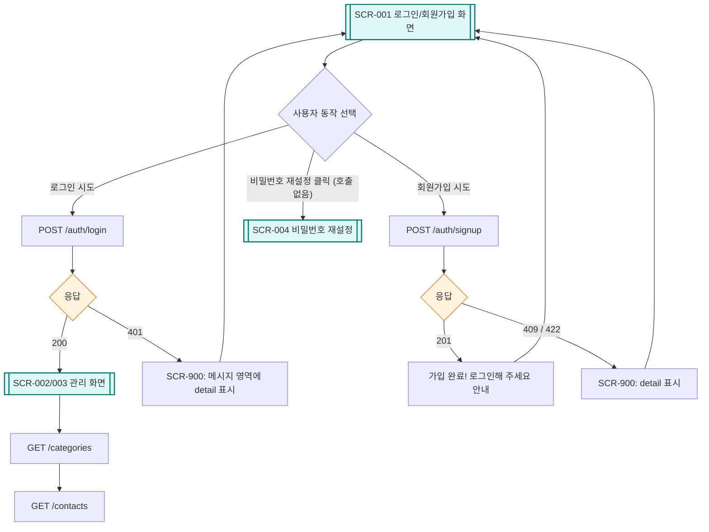
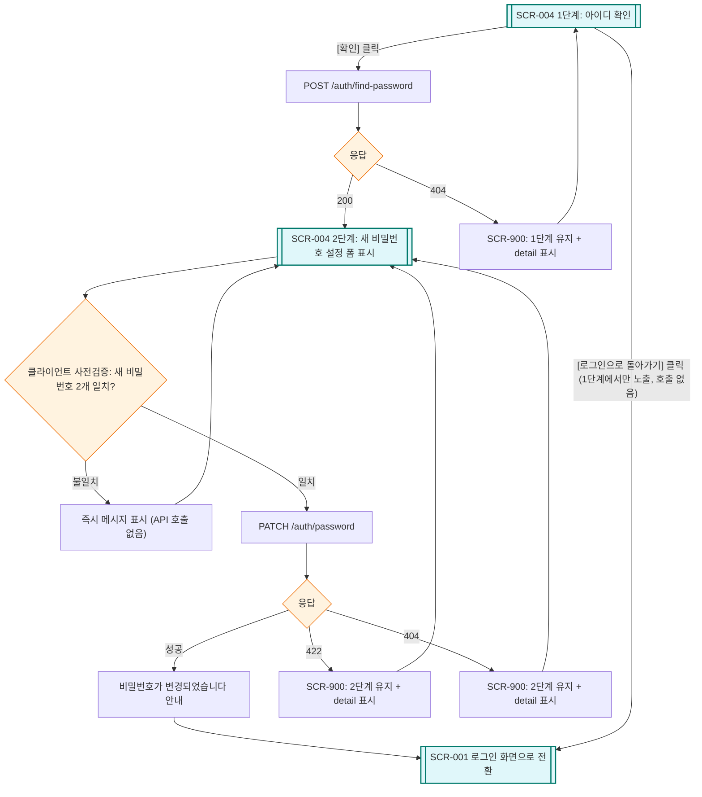
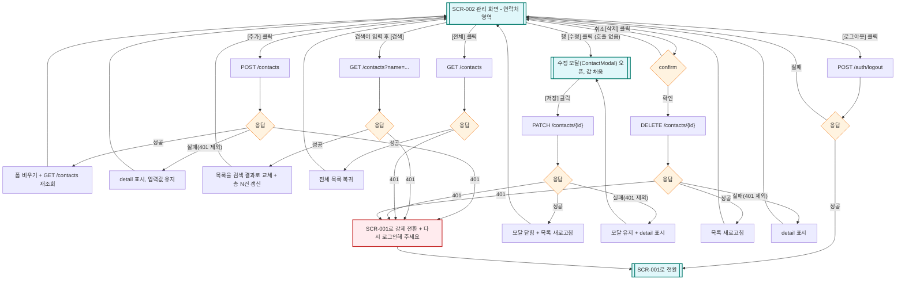
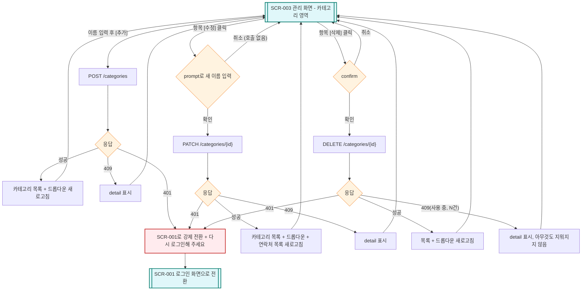
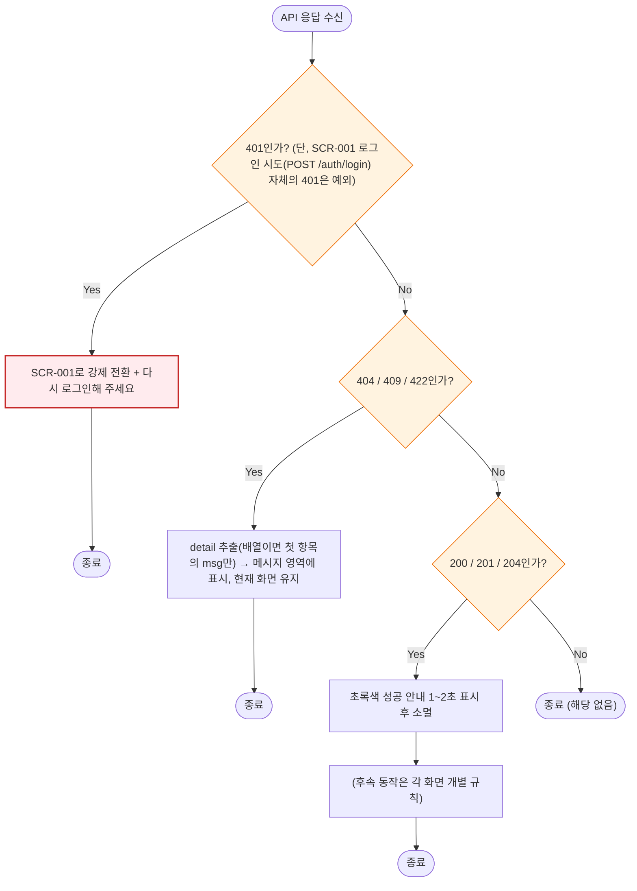

# 연락처 관리 웹 서비스 — 화면 정의서 (2차 과제)

| 항목 | 내용 |
|---|---|
| 문서명 | 연락처 관리 웹 서비스(2차 과제) 화면 정의서 |
| 문서 유형 | Screen Definition (UI Specification) |
| 과제 구분 | 2차 과제 — FastAPI + DB 연락처 프로그램 |
| 선행 과제 | 1차 과제 — 콘솔 연락처 관리 프로그램 |
| 버전 | v1.6 |
| 환경 | 웹 브라우저 (HTML + JavaScript) / 개발자용 Swagger UI |
| 상태 | 확정(Baseline) |

**이 문서의 역할(안내)** 사용자가 마주하는 모든 화면을 하나씩 정의합니다. 각 화면이 무엇을 보여주고, 어떤 입력을 받고, 어떤 API를 호출해서 다음 어디로 이동하는지를 규정합니다. 1차 과제에서 "화면"은 콘솔에 출력되는 텍스트 한 장면이었지만, 2차 과제의 화면은 브라우저에 그려지는 HTML 영역입니다. 그리고 2차 과제에는 화면이 한 종류 더 있습니다 — 개발자가 API를 테스트하는 Swagger UI(`/docs`)입니다.

**버전 관리 방침**: 이 문서(md)가 화면정의서의 정식 소스 오브 트루스입니다. 원본 PDF는 `docs/planning/old/02_연락처관리_웹서비스_화면정의서_v1.0.pdf`로 이동 보존되어 있습니다(더 이상 갱신 안 함, PDF도 다른 지난 버전과 동일하게 `old/`로 옮기는 게 원칙 — 예외 없음). 내용이 바뀔 때마다 PDF를 재변환하지 않고, 이 md 파일의 버전(v1.1, v1.2, ...)만 올려서 관리하고 참조합니다. PDF 재변환은 필요할 때 별도 요청 시에만(report-pdf 파이프라인, doc-writer + pdf-maker) 진행합니다.

> **변경 이력**
> - **v1.6 (2026-07-16)**: §4 SCR-004 "반영 완료" 문단의 03 문서 인용 버전이 v1.2로 남아 있던 stale 참조를 v1.3으로 정정했습니다(03 문서가 2026-07-15에 v1.3으로 개정된 이후 갱신되지 않았던 것을 바로잡음). 이 문단 외 나머지 내용은 전혀 변경하지 않았습니다.
> - **v1.5 (2026-07-14)**: 사용자 결정으로 "비밀번호 찾기" → "비밀번호 재설정" 명칭을 통일했습니다. §2 화면 목록 SCR-004 행("화면명"·"보이는 조건" 셀), §4 SCR-001 와이어프레임의 링크 라벨과 주석, §4 SCR-001 구성요소-동작 표의 "비밀번호 찾기 링크"·전환 대상 셀, §4 SCR-001 Mermaid의 화살표 레이블·노드 라벨, §4 SCR-004 헤딩, §4 SCR-004 1단계 와이어프레임 제목 줄의 "비밀번호 찾기"를 전부 "비밀번호 재설정"으로 정정했습니다. 로그인 화면 링크 텍스트는 사용자가 Figma에서 이미 확정한 "비밀번호 재설정" 표기와도 일치시켰습니다. 와이어프레임 박스 폭이 "비밀번호 재설정"(7자)으로 길어진 만큼 두 곳(SCR-001 링크 줄, SCR-004 1단계 제목 줄)의 여백 공백을 줄여 박스 정렬(east-asian 표시 너비 기준)을 원본과 동일하게 재계산했습니다. §4 SCR-004 "반영 완료" 안내 문단의 파일 버전 인용도 이번 라운드에서 함께 올라가는 새 버전(PRD v1.3, 01 v1.2, 03 v1.2)으로 동기화했습니다. §6 매핑 표는 SCR-004 ID와 API 경로만 있어 변경하지 않았습니다. 근거: `docs/planning/service-concept.md` §3-3. 과거 v1.1~v1.4 로그는 그대로 둡니다(당시 실제 명칭이므로 보존).
> - **v1.4 (2026-07-14)**: PRD(04 문서)가 v1.1로 개정되어 SCR-004(비밀번호 찾기)가 PR-13/UC-09/AC-18로 정식 반영되고, 01 문서(구현요구사항서)가 v1.1로 개정되어 FR-14(`POST /auth/find-password`)·FR-15(`PATCH /auth/password`)가 확정되고, 03 문서(기능정의서)가 v1.1로 개정되어 FN-014·FN-015가 반영됨에 따라, 이 문서의 "FR-13(신규, 01/03 문서 미반영)" 임시 표기(§2 화면 목록, §6 매핑 표) 2곳을 정확한 번호 "FR-14, FR-15"로 정정했습니다. SCR-004 절의 "아직 반영되지 않은 것" 안내 문단도 반영 완료 상태로 갱신했습니다. 다른 절(목적/와이어프레임/구성요소-동작 표/Mermaid 플로우차트 등)은 이번 작업과 무관하여 변경하지 않았습니다(surgical). 사용자 승인 하에 진행된 정합화 라운드입니다.
> - **v1.3 (2026-07-14)**: 팀 표준 4종 세트(목적/와이어프레임/구성요소-동작 표/Mermaid 플로우차트) 중 빠져 있던 Mermaid 플로우차트를 SCR-001, SCR-002, SCR-003, SCR-004, SCR-900 5개 화면 전부에 보완했습니다. 상태 분기(성공/실패/조건/화면 이동)는 service-planner의 브리프를 기반으로 작성했습니다. 기존 목적/와이어프레임/구성요소-동작 표 내용은 변경하지 않았습니다.
> - **v1.2 (2026-07-14)**: PRD 원본은 "비밀번호 찾기"를 비목표(N1, 범위 밖)로 명시했으나, 확정 디자인(로그인 화면)에 이미 "비밀번호 찾기" 링크가 있었고 사용자가 이번 기회에 기능 범위에 포함하기로 결정했습니다. 이에 따라 §2 화면 목록과 §4에 **SCR-004 · 비밀번호 찾기**를 신규 추가했습니다(와이어프레임 포함, 사용자 검토용 — 아직 Figma 디자인 전 단계). §6 매핑 표에도 반영했습니다. **이 화면이 요구하는 API 2종(`POST /auth/find-password`, `PATCH /auth/password`)은 아직 `01_구현요구사항서`·`03_기능정의서`에 없는 신규 항목입니다 — 이 문서만으로는 반영 완료가 아니며, 그 두 문서도 별도로 갱신이 필요합니다(범위 안내, 이번 라운드에서 자동으로 처리하지 않음).**
> - **v1.1 (2026-07-14)**: 원본 PDF(v1.0)는 연락처 수정 UI를 "행 클릭 → 추가 폼이 편집 모드로 전환되는 인라인 편집" 방식으로 정의하고 있었습니다. 그러나 확정 디자인 8개 프레임(Figma, "확정 디자인 - 절대 원본 건들지 말것" 라벨) 중 `main-수정`(248:8103)은 **모달(ContactModal) 방식**으로 만들어져 있고, 우선순위상 확정 디자인이 문서보다 우선합니다. 이에 따라 본 문서의 §4 SCR-002 중 연락처 수정 관련 두 행(행의 [수정], 편집 모드 [저장])을 모달 방식으로 갱신했습니다. 이 변경 외 나머지 내용은 원본 PDF(v1.0)와 동일합니다.

---

## 1. 화면 구성 전략 — "한 페이지, 두 개의 섹션" (아키텍처 결정)

본 과제의 웹 화면은 HTML 파일 1장(`GET /`)으로 만들고, 그 안의 두 섹션을 보였다/숨겼다 하는 방식으로 구성합니다.

```
index.html (한 장)
├── [섹션 A] 로그인 화면  ← 로그인 전에만 보임
└── [섹션 B] 관리 화면    ← 로그인 후에만 보임
```

**왜 페이지를 여러 장 만들지 않나요? (설계 근거)**

| 이유 | 설명 |
|---|---|
| 배운 것만으로 가능 | 섹션 전환은 JavaScript로 `style.display`를 바꾸는 것 — 이미 배운 DOM 조작 그대로입니다 |
| 페이지 이동 개념 불필요 | 여러 장으로 나누면 "이동할 때마다 로그인 상태를 다시 확인"하는 로직이 페이지마다 반복됩니다 |
| 실무 연결 | 실무의 SPA(Single Page App — 예: Gmail, 카카오맵)가 정확히 이 방식의 확장판입니다. "페이지를 갈아끼우지 않고 화면 일부만 갱신"하는 감각을 여기서 처음 익힙니다 |

**비유로 이해하기 — "연극 무대의 장면 전환"** 극장(브라우저 탭)은 하나입니다. 조명이 바뀌면(로그인 성공) 무대 위 세트가 로그인 장면에서 관리 장면으로 바뀔 뿐, 관객이 극장을 옮기지 않습니다. 1차 과제의 콘솔도 사실 같은 구조였습니다 — 터미널 창(극장)은 하나이고 출력 내용(장면)만 바뀌었죠.

---

## 2. 화면 목록 (Screen Inventory)

| 화면 ID | 화면명 | 보이는 조건 | 대응 FR |
|---|---|---|---|
| SCR-001 | 로그인 / 회원가입 섹션 | 로그인 전 (또는 세션 만료) | FR-01, FR-02 |
| SCR-004 | 비밀번호 재설정 | SCR-001에서 "비밀번호 재설정" 클릭 시 (하위 흐름) | FR-14, FR-15 |
| SCR-002 | 관리 화면 — 연락처 영역 | 로그인 후 | FR-05 ~ FR-08 |
| SCR-003 | 관리 화면 — 카테고리 영역 | 로그인 후 (SCR-002와 같은 화면 안) | FR-09 ~ FR-12 |
| SCR-900 | 공통 메시지 / 오류 표시 | 모든 화면 | NFR-01 |
| DEV-001 | Swagger UI (`/docs`) | 개발자 전용 (브라우저 접속) | 전체 API |

---

## 3. 화면 전이도 (전체 워크플로우)

화면이 언제 바뀌는지의 전체 흐름입니다. 핵심 규칙은 하나 — **"어느 섹션을 보여줄지는 `GET /auth/me`의 응답이 결정한다"** 입니다.

- 브라우저 접속(`GET /`) → `GET /auth/me` 호출로 로그인 상태 확인(매 접속 1회)
- 401(로그인 안 됨) → **SCR-001 로그인/회원가입 섹션**: 아이디·비밀번호 입력, 가입 성공 → 로그인 폼으로 안내, 로그인 실패 → 오류 메시지 표시
- 200(로그인 상태) → **SCR-002/003 관리 화면**: 연락처 목록·추가·수정·삭제·검색, 카테고리 목록·추가·수정·삭제, 상단은 사용자명 + 로그아웃 버튼
- SCR-001에서 로그인 성공(200 + 쿠키) → SCR-002/003으로 전환
- SCR-002/003에서 로그아웃 또는 세션 만료(401) → SCR-001로 복귀

1차 과제의 "모든 기능은 처리 후 메인 메뉴로 복귀"가 → "모든 처리 후 관리 화면의 목록을 새로 고침"으로 바뀐 구조입니다.

**초보자 포인트**: 1차 과제의 메인 메뉴(SCR-001)가 하던 "허브" 역할을 2차에서는 관리 화면이 합니다. 다른 점은, 2차에는 그 허브에 들어가기 위한 문(로그인 화면)이 하나 생겼다는 것뿐입니다.

---

## 4. 화면 상세 정의

### SCR-001 · 로그인 / 회원가입 섹션

- **목적**: 사용자를 확인하고 세션을 시작한다. 처음 온 사용자는 가입부터 한다.
- **레이아웃 (와이어프레임)**

```
┌─────────────────────────────────────┐
│   연락처 관리 서비스                    │
│                                       │
│  아이디   [ happyday        ]        │ ← placeholder: "영문 소문자·숫자 4~20자"
│  비밀번호 [ ●●●●●●●●          ]        │ ← placeholder: "4~20자"
│                                       │
│  ☐ 로그인 상태 유지   비밀번호 재설정 → │ ← "비밀번호 재설정" 클릭 시 SCR-004로 이동
│                                       │
│  [ 로그인 ]   [ 회원가입 ]              │
│                                       │
│  ⚠ 아이디 또는 비밀번호가              │ ← SCR-900 메시지 영역 (평소엔 비어 있음)
│    올바르지 않습니다                    │
└─────────────────────────────────────┘
```

**구성 요소와 동작**

| 요소 | 사용자 동작 | 호출 API | 성공 시 | 실패 시 |
|---|---|---|---|---|
| 로그인 버튼 | 아이디·비밀번호 입력 후 클릭 | `POST /auth/login` | 관리 화면 섹션으로 전환 + 데이터 로딩 | 401 → 메시지 영역에 `detail` 표시 |
| 회원가입 버튼 | 같은 입력값으로 클릭 | `POST /auth/signup` | "가입 완료! 로그인해 주세요" 안내 | 409(중복)/422(형식) → `detail` 표시 |
| 비밀번호 재설정 링크 | 클릭 | (호출 없음) | **SCR-004 비밀번호 재설정**으로 전환 | - |

**화면 흐름 (Flowchart)**



**입력 예시 안내 규칙 (1차 과제 규칙 계승)**: 1차 과제는 프롬프트에 `종류(ex.가족, 친구, 기타):` 처럼 예시를 괄호로 보여줬습니다. 웹에서는 같은 역할을 입력창의 `placeholder` 속성이 합니다. 모든 입력창에 placeholder로 형식 예시를 제공해야 합니다.

### SCR-004 · 비밀번호 재설정 (신규, 2026-07-14 — 사용자 검토용, Figma 디자인 전)

> **범위 결정 (2026-07-14)**: PRD는 원래 이 기능을 비목표(N1)로 뒀지만, 확정 디자인에 링크가 이미 있어 이번에 기능 범위로 포함하기로 확정했습니다. 본인 확인 방식은 세 안(①가입 시 보안질문 추가 ②이메일 발송 ③아이디만 확인 후 즉시 재설정) 중 **③ "아이디만 확인 후 바로 재설정"** 으로 결정했습니다 — 이메일 발송(②)은 SMTP 서버가 필요해 이번 과제 범위를 넘고, 보안질문(①)은 검증 로직이 추가로 필요해 이번 범위에는 과할 수 있다고 판단했습니다. **알려진 트레이드오프**: 아이디 존재 여부만으로 바로 재설정을 허용하므로, 아이디만 알면 누구나 그 계정 비밀번호를 바꿀 수 있습니다(실제 서비스라면 부적합한 수준의 보안이지만, 이번 과제 범위에서는 허용하기로 결정된 의도적 단순화입니다).

- **목적**: 아이디만으로 본인 확인 후, 이메일/링크 없이 그 자리에서 새 비밀번호를 설정한다.
- **레이아웃 (와이어프레임 — 2단계)**

```
1단계: 아이디 확인
┌─────────────────────────────────────┐
│   비밀번호 재설정                      │
│                                       │
│  아이디   [ happyday        ]        │ ← placeholder: "가입 시 사용한 아이디"
│                                       │
│  [ 확인 ]        [ 로그인으로 돌아가기 ] │
│                                       │
│  ⚠ 존재하지 않는 아이디입니다          │ ← SCR-900 메시지 영역 (평소엔 비어 있음)
└─────────────────────────────────────┘

2단계: 새 비밀번호 설정 (1단계 확인 성공 시에만 표시)
┌─────────────────────────────────────┐
│   새 비밀번호 설정                     │
│                                       │
│  아이디: happyday (확인됨)             │
│  새 비밀번호     [ ●●●●●●●●     ]      │ ← placeholder: "4~20자"
│  새 비밀번호 확인 [ ●●●●●●●●     ]      │ ← placeholder: "위와 동일하게 입력"
│                                       │
│  [ 비밀번호 변경 ]                     │
│                                       │
│  ⚠ 두 비밀번호가 일치하지 않습니다      │ ← SCR-900 메시지 영역 (평소엔 비어 있음)
└─────────────────────────────────────┘
```

**구성 요소와 동작**

| 요소 | 사용자 동작 | 호출 API | 성공 시 | 실패 시 |
|---|---|---|---|---|
| 1단계 [확인] | 아이디 입력 후 클릭 | `POST /auth/find-password`(신규) | 2단계(새 비밀번호 설정) 폼 표시 | 404(존재하지 않음) → `detail` 표시 |
| 2단계 [비밀번호 변경] | 새 비밀번호 2회 입력 후 클릭 | `PATCH /auth/password`(신규) | "비밀번호가 변경되었습니다" 안내 후 SCR-001(로그인)로 복귀 | 422(형식/불일치) → `detail` 표시, 404(1단계 이후 계정이 사라진 경우 등 예외) → `detail` 표시 |
| [로그인으로 돌아가기] | 클릭 (1단계에서만 노출) | (호출 없음) | SCR-001로 복귀 | - |

**화면 흐름 (Flowchart)**



**클라이언트 검증**: 2단계의 "새 비밀번호 확인"란은 서버 호출 전에 화면에서 먼저 두 값이 같은지 확인한다(불일치 시 API 호출 자체를 안 함) — §4 SCR-002의 "잘못된 입력이 불가능한 UI" 원칙과 동일한 방향.

**반영 완료 (v1.4)**: `POST /auth/find-password`, `PATCH /auth/password` 2개 API는 PRD `docs/planning/04_연락처관리_웹서비스_PRD_v1.3.md`(PR-13, UC-09, AC-18), 01 문서 `docs/planning/01_연락처관리_웹서비스_구현요구사항_v1.2.md`(FR-14, FR-15), 03 문서 `docs/planning/03_연락처관리_웹서비스_기능정의서_v1.3.md`(FN-014, FN-015)에 모두 정식 반영되었습니다. Figma 디자인 착수 및 실제 와이어프레임 제작(3-B번 전체 확장 단계)은 이후 별도 라운드에서 진행합니다.

### SCR-002 · 관리 화면 — 연락처 영역 (아키텍처)

로그인 후 보이는 메인 화면입니다. 연락처 추가 폼(왼쪽/위) + 검색 + 연락처 목록(총 N건, 수정·삭제 버튼 포함) + 카테고리 관리(SCR-003, 같은 화면 우측) + 상단 바(사용자명 + 로그아웃)로 구성됩니다. 화면 하단에는 SCR-900 공통 메시지 영역(성공/오류 안내)이 표시됩니다.

**구성 요소와 동작**

| 요소 | 사용자 동작 | 호출 API | 성공 시 화면 반응 |
|---|---|---|---|
| 추가 폼 + [추가] | 4개 항목 입력 후 클릭 | `POST /contacts` | 폼 비우기 + 목록 새로 고침(`GET /contacts`) |
| 종류 드롭다운 | 목록에서 선택 | (없음 — `GET /categories` 결과로 미리 채워짐) | - |
| 검색창 + [검색] | 이름 입력 후 클릭 | `GET /contacts?name=윤아` | 목록을 검색 결과로 교체, "총 N건" 갱신 |
| [전체] | 클릭 | `GET /contacts` | 전체 목록으로 복귀 |
| 행의 [수정] | 클릭 | (호출 없음) | 그 행의 값이 채워진 **수정 모달(ContactModal)** 오픈 |
| 수정 모달 [저장] | 모달 안에서 값 고친 후 클릭 | `PATCH /contacts/{id}` | 모달 닫힘 + 목록 새로 고침 |
| 행의 [삭제] | 클릭 → 확인 대화상자(confirm) | `DELETE /contacts/{id}` | 목록 새로 고침 |
| [로그아웃] | 클릭 | `POST /auth/logout` | 로그인 섹션(SCR-001)으로 전환 |

**화면 흐름 (Flowchart)**



> **연락처 수정 UI: 모달 방식 확정 (2026-07-14)**
> 원본 v1.0은 "행의 [수정] 클릭 → 추가 폼이 편집 모드로 전환(버튼이 [추가]에서 [저장]으로 바뀜)"하는 인라인 편집 방식이었습니다. 확정 디자인(`main-수정`, 248:8103)은 별도의 수정 모달을 여는 방식이므로, 위 표를 그에 맞춰 갱신했습니다. 모달을 닫는 액션(취소/바깥 클릭/Esc)에 대한 상세 규칙은 아직 화면정의서 수준에서 명문화되어 있지 않으며, 필요 시 이후 라운드에서 UI 상세 설계로 보완합니다.

**종류가 "입력"에서 "선택"으로 바뀐 이유 (중요한 설계 포인트)**: 1차 과제에서는 종류를 글자로 입력받아 `validate_type` 함수로 "가족/친구/기타 중 하나인지" 검사했습니다. 2차 과제에서는 드롭다운(select)으로 바꿔서, 애초에 목록에 있는 값만 고를 수 있게 합니다. 즉 "잘못된 입력을 검사"하는 대신 "잘못된 입력이 불가능한 UI"로 설계하는 것입니다. 실무 UI 설계의 기본 원칙이며, 1차 과제의 검증 함수 하나가 화면 설계로 대체되는 순간입니다. (물론 서버는 여전히 category_id를 검증합니다 — 화면을 거치지 않고 API를 직접 호출하는 경우가 있기 때문입니다. §7 참조)

### SCR-003 · 관리 화면 — 카테고리 영역

| 요소 | 사용자 동작 | 호출 API | 성공 시 | 실패 시 |
|---|---|---|---|---|
| 새 카테고리 + [추가] | 이름 입력 후 클릭 | `POST /categories` | 카테고리 목록 + 드롭다운 새로 고침 | 409 이름 중복 → `detail` 표시 |
| 항목의 [수정] | 클릭 → 새 이름 입력(prompt) | `PATCH /categories/{id}` | 목록 + 드롭다운 + 연락처 목록까지 새로 고침 (소속 연락처의 종류 표기가 바뀌므로) | 409 이름 중복 |
| 항목의 [삭제] | 클릭 → 확인 대화상자 | `DELETE /categories/{id}` | 목록 + 드롭다운 새로 고침 | 409 사용 중 → `detail`("...연락처가 N건 있어 삭제할 수 없습니다") 표시 |

**화면 흐름 (Flowchart)**



### SCR-900 · 공통 메시지 / 오류 표시 규칙

모든 API 실패는 `{"detail": "..."}` 형태로 오므로(01 문서 §5-2), 화면의 오류 처리는 한 가지 규칙으로 통일합니다.

| 상황 | 화면 동작 |
|---|---|
| 응답이 401 (로그인 시도 자체의 401 제외) | 세션 만료로 간주 → 로그인 섹션으로 전환 + "다시 로그인해 주세요" |
| 응답이 404 / 409 / 422 | 응답의 `detail`을 메시지 영역에 그대로 표시 (문구를 화면에서 새로 만들지 않음 — 서버가 단일 출처) |
| 성공 (200/201/204) | 초록색 안내 1~2초 표시 후 사라짐 (예: "추가되었습니다") |
| 422의 detail이 목록 형태일 때 | Pydantic 자동 422는 detail이 배열이므로, 첫 항목의 `msg`만 뽑아 표시 |

**화면 흐름 (Flowchart)**



**1차 과제 대응**: 1차의 SCR-900(공통 메시지)에 있던 "잘못된 입력입니다", "해당하는 회원 정보가 없습니다" 같은 문구들이, 2차에서는 서버의 `detail` 문구가 되어 내려오고 화면은 그것을 보여주기만 합니다. 문구의 주인이 화면에서 서버로 바뀐 것입니다 — 문구를 고칠 일이 생기면 서버 한 곳만 고치면 됩니다.

---

## 5. 단계별 워크플로우 — 페이지 로드부터 목록 표시까지

화면 코드(JavaScript)가 실제로 실행하는 순서입니다. "화면이 스스로 상태를 판단하고 데이터를 채우는" 이 흐름이 2차 과제 프론트엔드의 뼈대입니다.

1. 페이지 로드(`index.html`)
2. `fetch("GET /auth/me")`
3. 응답 200? → Yes: ③ 관리 섹션 표시(상단 바에 사용자명 표시, `me` 응답 사용) / No(401): 로그인 섹션 표시 → 로그인 성공 시 ③번으로 합류
4. `fetch("GET /categories")` — 종류 드롭다운 + 카테고리 목록 채우기
5. `fetch("GET /contacts")` — "총 N건" + 목록 테이블 그리기
6. 버튼들에 이벤트 연결 — 추가·검색·수정·삭제 → 각 API 호출
7. 사용자 조작 대기 (완료)

**④가 ⑤보다 먼저인 이유**: 연락처 추가 폼의 종류 드롭다운은 카테고리 목록이 있어야 채울 수 있습니다. "화면의 어떤 부분이 어떤 데이터에 의존하는가"를 따져 호출 순서를 정하는 것 — 이것이 프론트엔드 설계의 기본 감각입니다.

---

## 6. 화면–기능–요구사항 매핑

| 화면 ID | 호출 API | 요구사항(FR) | 1차 과제 대응 화면 |
|---|---|---|---|
| SCR-001 | `POST /auth/signup`, `POST /auth/login` | FR-01, FR-02 | (없음 — 신규) |
| SCR-004 | `POST /auth/find-password`(신규), `PATCH /auth/password`(신규) | FR-14, FR-15 | (없음 — 신규) |
| SCR-002 | `GET/POST /contacts`, `PATCH/DELETE /contacts/{id}` | FR-05 ~ FR-08 | SCR-001~005 (메뉴·추가·목록·수정·삭제) |
| SCR-003 | `GET/POST /categories`, `PATCH/DELETE /categories/{id}` | FR-09 ~ FR-12 | (없음 — 신규) |
| SCR-900 | (모든 응답의 detail) | NFR-01 | SCR-900 공통 메시지 |
| DEV-001 | 전체 API | NFR-06 | (없음 — 신규) |

---

## 7. DEV-001 · 개발자 화면: Swagger UI (`/docs`)

FastAPI가 자동 생성하는 API 테스트 화면입니다. HTML 화면을 만들기 전에, 모든 API를 여기서 먼저 검증하는 것이 이 과제의 표준 작업 순서입니다.

**사용 순서**

1. 브라우저에서 `http://127.0.0.1:8000/docs` 접속
2. `POST /auth/signup` 펼치기 → Try it out → 본문 입력 → Execute → 201 확인
3. `POST /auth/login` 실행 → 200 확인 — 이때 브라우저에 세션 쿠키가 저장됨
4. 이후 `GET /contacts` 등 보호 API를 실행하면 쿠키가 자동 첨부되어 그대로 동작 (Swagger UI가 같은 주소에서 열리므로 브라우저가 쿠키를 함께 보냄)
5. `POST /auth/logout` 실행 후 보호 API 재실행 → 401 확인 — 세션 삭제가 실제로 동작하는지 확인

**화면 없이도 API를 검증할 수 있어야 하는 이유**: 실무에서 백엔드와 프론트엔드는 보통 다른 사람이 만듭니다. 백엔드 개발자는 화면이 완성되기 전에 자기 API가 맞는지 스스로 증명해야 하고, 그 도구가 Swagger UI(또는 테스트 코드)입니다. 또한 §4의 드롭다운처럼 화면이 잘못된 입력을 막아 준다 해도, API는 화면을 거치지 않고 직접 호출될 수 있으므로 서버 검증은 절대 생략할 수 없습니다 — Swagger UI에서 일부러 잘못된 값을 넣어 보는 것이 그 확인 방법입니다.

---

## 8. 화면 공통 규칙

| 규칙 | 내용 | 1차 과제 대응 |
|---|---|---|
| 예시 안내 | 모든 입력창에 placeholder로 형식 예시 제공 | 프롬프트의 (ex: ...) 괄호 안내 |
| 처리 후 갱신 | 추가/수정/삭제 성공 시 관련 목록을 즉시 새로 고침 | "처리 후 메인 메뉴 복귀" |
| 파괴적 동작 확인 | 삭제는 반드시 확인 대화상자(confirm)를 거침 | (신규 — 웹 표준 관례) |
| 견고성 | 어떤 응답(401/404/409/422)에도 화면이 멈추지 않고 메시지 표시 | "어떤 입력에도 프로그램이 죽지 않음" |
| 한글 처리 | `<meta charset="UTF-8">` 명시 | 출력 인코딩 보장 |
| 이중 제출 방지 | 요청 진행 중에는 버튼 비활성화 (연타로 중복 등록 방지) | (신규 — 웹 특유의 문제) |
